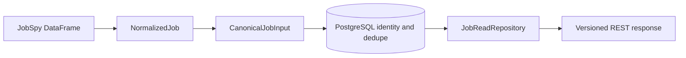

# Data API Reference

This file is the compact public API reference. The full storage/query design is in [Database and Data API](modules/database-and-data-api.md); field semantics are in [Job Data Taxonomy](JOB_DATA_TAXONOMY.md).

## Data flow



Public job contracts are `job.v3`, `job-detail.v4`, `job-page.v3`, and
`job-facets.v2`, stored in `schemas/`. Detail v4 names source-provided skills
explicitly as `source_skills`; normalized filter/display values remain in
`skill_tags`. `jobs` stores current canonical values; `raw_job_snapshots` stores
auditable source payloads. Raw provider payloads are not returned by the API.

## Start the API

```bash
PYTHONPATH=src .venv/bin/uvicorn wecanfindintern.api.app:app --reload
```

## Routes

### `GET /api/v1/jobs`

Supported filters:

`query`, `location`, `country`, `region`, `city`, `company`, `work_mode`,
`employment_type`, `opportunity_type`, `schedule_type`, `category`,
`subcategory`, `skill`, `season`, `recruiting_year`, `recruiting_term`,
`has_recruiting_term`, `source`, `posted_after`, `salary_min`,
`annual_salary_min`, `annual_salary_max`, `hourly_salary_min`,
`hourly_salary_max`, `has_salary`, `currency`, `cursor`, and `limit`.

`limit` accepts 1–100 and defaults to 30. Filters are validated by `JobListFilters`; invalid dates, salary expressions, cursor values, or values rejected by the model produce HTTP 422.

Example:

```http
GET /api/v1/jobs?country=CA&region=ON&opportunity_type=co_op&category=software_engineering&limit=30
```

Response:

```json
{
  "schema_version": "job-page.v3",
  "items": [],
  "total_count": 0,
  "last_updated_at": null,
  "next_cursor": null,
  "has_more": false
}
```

The list is active-job only and uses keyset pagination on
`(published_sort_at, id)`. `total_count` covers the complete filtered active set,
while `last_updated_at` reports the greatest current ingestion/job visibility
timestamp. Text queries filter through PostgreSQL full-text search and the public
route retains newest-first ordering.

### `GET /api/v1/jobs/{job_id}`

`job_id` is the public UUID. The response contains canonical job details and all source links. Provider raw payloads and internal normalized keys are excluded. Missing IDs return HTTP 404.

### `GET /api/v1/jobs/facets`

Returns live counts for opportunity types, schedule types, categories, work modes, skills, locations, and companies. The frontend uses this response to build filter controls.

### `GET /api/v1/jobs/geo-distribution`

Returns active-job counts by Canadian province/territory and US state plus
country and overall totals. The heatmap consumes the region codes and counts;
the endpoint does not expose source payloads or individual job records.

## Location response

Locations preserve source text while exposing structured filters:

```json
{
  "text": "Toronto, ON, Canada",
  "display_name": "Toronto, ON, Canada",
  "country_code": "CA",
  "country_name": "Canada",
  "region_code": "ON",
  "region_name": "Ontario",
  "region_type": "province",
  "city": "Toronto"
}
```

`region_type` is `province`, `territory`, `state`, or `region`. Unknown portions remain empty rather than being inferred. `text` remains the source-derived value.

## Deduplication contract

Source-level idempotency uses the SHA-256 source fingerprint. Cross-source candidates use direct URL hash, company/location block, publication date proximity, and a maximum candidate count; application comparison uses company/title/location/date/direct URL and description shingle similarity. Decisions and algorithm versions are stored for audit. A confirmed match merges sources; a non-match remains a separate job.

## Performance contract

Active partial indexes serve feed filters. Lists use cursor pagination, execute a
separate filtered count/freshness query, and avoid source-payload aggregation.
Details load source links separately. Raw snapshots are time-partitioned and
indexed for audit/retention. The connection pool and statement timeout bound
database resource usage.

## Request outcomes

| Request condition | Response behavior |
|---|---|
| Valid filters with matching jobs | 200 with active items, total, freshness, cursor, and `has_more` |
| Valid filters with no matches | 200 with empty `items`, `total_count=0`, and no cursor |
| Repeated multi-value filters | values are validated/normalized and combined by the repository contract |
| Invalid date, salary, cursor, enum-like value or bounds | 422 with no query mutation |
| Detail UUID is well formed but absent | 404 |
| Detail path is not a UUID | FastAPI validation response |
| Database/pool operation fails | request fails; no fabricated empty success |

## Verification

`scripts/dev/verify_data_api_contract.py` validates exported examples and
schema/model alignment. `scripts/dev/verify_frontend_api_contract.py` checks
that frontend route references exist. Route/repository behavior is covered by
`tests/test_routes.py` and database-marked integration tests.
