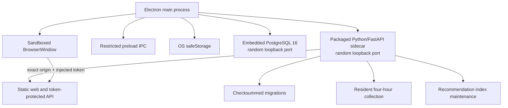
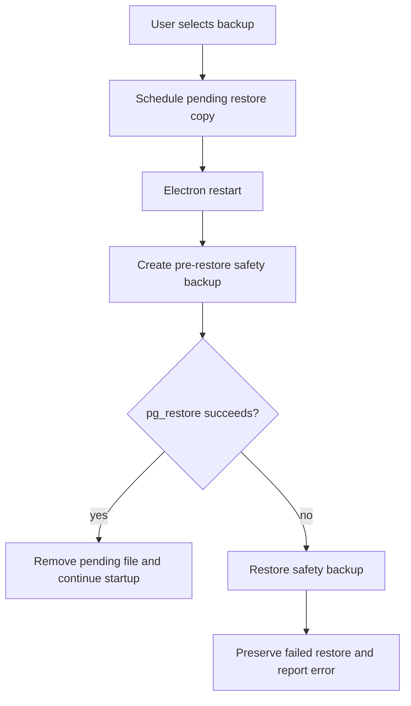
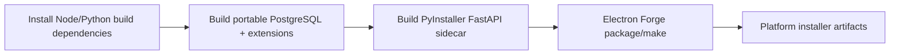

# Desktop Application

The delivered desktop runtime packages the web UI and FastAPI application as a
self-contained local-first product for macOS and Windows. End users run the
bundled Python service and PostgreSQL runtime directly from Electron; Docker and
a separately installed Python/PostgreSQL runtime are development dependencies,
not desktop runtime dependencies.

## Runtime architecture



The renderer has no Node.js access. Context isolation and Chromium sandboxing are
enabled. Electron injects a random per-launch token only for requests to the exact
sidecar origin; direct requests without that token receive HTTP 401. PostgreSQL
uses SCRAM authentication, listens only on `127.0.0.1`, and on macOS also uses a
private mode-0700 Unix socket directory.

Closing the main window hides it instead of quitting. The tray menu can reopen the
window, run collection immediately, create a backup, restore a backup, or quit.
The packaged app registers itself for login startup with `--background`; scheduled
collection therefore continues while the user session and tray app are running.

Startup is fail-closed: Electron verifies the embedded PostgreSQL bundle, creates
or validates the PostgreSQL data directory, chooses a free loopback port, starts
the database, starts the Python sidecar, waits up to 60 seconds for its JSON
`ready` line, and only then navigates the renderer. The sidecar rejects non-loopback
bind addresses, requires the desktop token and both resource/data directories,
applies migrations before serving, and logs startup failures to the user data
directory.

## Local data

Electron owns the standard per-user application-data directory:

- macOS: `~/Library/Application Support/WeCanFindIntern`
- Windows: `%APPDATA%\WeCanFindIntern`

It contains PostgreSQL data, WaterlooWorks SQLite/Chrome profile, logs, model cache,
encrypted secrets, backups, and runtime locks. Application upgrades do not replace
this directory. Ordered SQL migrations run before the API accepts traffic, and
applied migration checksums prevent silent schema drift.

AI API keys are encrypted through Electron `safeStorage` (macOS Keychain and Windows
DPAPI-backed storage). Non-secret AI preferences remain in renderer local storage.
On first desktop launch, existing keys found in local storage are moved to secure
storage and removed from the browser record.

## Backup and recovery



The app creates one PostgreSQL custom-format backup per day and retains the latest
14 automatic backups. Manual backup and restore are available from the tray.
Restore is applied before the API starts on the next launch. A pre-restore safety
backup is always created; a failed restore automatically rolls back to it. Backup
directories use mode 0700 and dump files mode 0600 on macOS.

Restoring a PostgreSQL backup replaces PostgreSQL application data only. The
WaterlooWorks SQLite database, Chrome profile, model cache, and OS-encrypted keys
remain separate.

Restore is not an incremental merge. The main process stops the backend/database
as required, creates a pre-restore safety dump, restores the selected dump, and
uses the safety dump to roll back if restore fails. If both restore and rollback
fail, the app reports both errors and the safety directory must be preserved for
manual recovery. A backup is not a substitute for source-level reruns: public
collection and WaterlooWorks use their own idempotent restart semantics.

## Build prerequisites

The build pipeline is platform-native:



Common:

- Node.js 22+
- Python 3.12+
- the dependencies in `requirements-desktop.txt`
- Electron dependencies installed with `npm ci` in `desktop/`

macOS additionally needs Xcode Command Line Tools. The build script compiles a
pinned OpenSSL LTS release as a static library, so the packaged `pgcrypto` does
not depend on Homebrew or a host-only OpenSSL dylib. Build
the portable PostgreSQL 16 + pgcrypto + pg_trgm + pgvector runtime, the Python
sidecar, and the installer with:

```bash
scripts/desktop/build_postgres_macos.sh
python scripts/desktop/build_backend.py --clean
cd desktop
npm ci
npm run make
```

The PostgreSQL script builds from pinned source with a relocation-safe common
prefix, rewrites remaining Mach-O dependency paths, bundles any required
non-system libraries, and ad-hoc signs rewritten native images before the outer
app signing step. All native database files are built and checked against a
macOS 13.0 deployment target, matching Electron's minimum supported version.

On Windows, run from an x64 Visual Studio Developer PowerShell with PostgreSQL 16
installed for the build machine:

```powershell
python -m pip install -r requirements-desktop.txt
npm --prefix desktop ci
scripts\desktop\build_postgres_windows.ps1
python scripts\desktop\build_backend.py --clean
npm --prefix desktop run make
```

The PowerShell script builds pgvector with `nmake`, then stages only PostgreSQL's
`bin`, `lib`, and `share` runtime directories; it never copies the build machine's
database data directory. The PostgreSQL distribution already supplies pgcrypto
and pg_trgm. Squirrel install/update/uninstall events are handled before the app
runtime starts, so they cannot accidentally initialize a database or collector.
End users do not need PostgreSQL or Visual Studio.

`desktop-release.yml` provides a manually triggered macOS/Windows build matrix and
uploads installers as GitHub Actions artifacts. It does not deploy a server or
publish to an app store.

## Signing and direct distribution

Unsigned artifacts are suitable for internal verification. For normal direct
distribution, set `APPLE_IDENTITY`, `APPLE_ID`, `APPLE_APP_SPECIFIC_PASSWORD`, and
`APPLE_TEAM_ID` in the macOS release environment. Electron Forge applies those
settings during the macOS packaging/notarization path.

Major PostgreSQL upgrades must not point a newer server directly at the existing
data directory. Ship a backup/restore or `pg_upgrade` migration before changing the
embedded major version. PostgreSQL 16 patch releases can replace the bundled
binaries while preserving the data directory.

## Operational boundaries

- No Docker process is started by the desktop build.
- No externally reachable listener is created; both services bind to loopback.
- Public job collection still needs outbound internet access and must respect
  source-site terms and rate limits.
- WaterlooWorks requires a locally installed Google Chrome and interactive SSO/MFA.
- Remote Gemini/OpenAI/DeepSeek/GLM/Qwen features use their public APIs; Ollama and
  native TTS can remain fully local.
- Build macOS artifacts on macOS and Windows artifacts on Windows. Native sidecars
  and PostgreSQL cannot be reliably cross-compiled by Electron Forge alone.

## Desktop failure matrix

| Signal | Meaning | Action |
|---|---|---|
| app opens but API is unavailable | backend sidecar exited or timed out | inspect `logs/backend-*.log`, then retry after fixing resources/migrations |
| PostgreSQL bundle incomplete | native runtime or pgvector artifact missing | rebuild the platform bundle; do not use a host data directory |
| PostgreSQL major mismatch | existing user data was created by another major version | restore a compatible dump or perform the documented `pg_upgrade` procedure |
| `401 Desktop authentication required` | renderer request lacks the current launch token | reload through Electron; do not expose the sidecar port publicly |
| collection status says interrupted | previous background task stopped while `running` | leave existing data in place; the scheduler performs a fresh idempotent run |
| restore failed | selected custom-format dump was incompatible/corrupt or DB failed | automatic safety rollback; preserve both error logs and safety backup |

Desktop background public collection defaults to enabled by the packaged Electron
environment and runs after its initial delay, then at the configured four-hour
interval. Its status file is atomic and diagnostic only; it is not a page-level
checkpoint.
