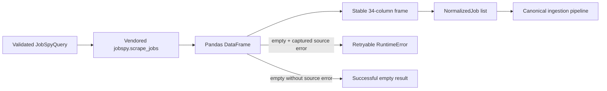

# JobSpy Integration Reference

This document is the stable reference for the external JobSpy boundary. For the complete ingestion lifecycle, see [Job Ingestion](modules/job-ingestion.md). For the canonical job and derived fields, see [Domain and Data Normalization](modules/domain-normalization.md).

## Version baseline

- Upstream project: <https://github.com/speedyapply/JobSpy>
- Package: `python-jobspy`
- Audited version: `1.1.82`
- Vendored commit: `fda080a373e8226f3fd60635323f5da9af9892b1`
- Python requirement: 3.10+

The source lives in `vendor/JobSpy` and is installed as the project’s local editable dependency. This keeps scraper behavior reproducible and makes source upgrades reviewable.

## JobSpy DataFrame columns

`jobspy.scrape_jobs()` returns a pandas DataFrame. The adapter stabilizes these 34 fields:

| Field | Meaning |
|---|---|
| `id` | Source job ID |
| `site` | Source name |
| `job_url` | Source listing URL |
| `job_url_direct` | Direct application URL |
| `title` | Job title |
| `company` | Company name |
| `location` | Flattened source location |
| `date_posted` | Source posted date |
| `job_type` | Comma-separated source employment types |
| `salary_source` | Provider salary origin |
| `interval` | Salary interval |
| `min_amount` / `max_amount` | Salary bounds |
| `currency` | Salary currency |
| `is_remote` | Provider remote flag |
| `job_level` | Source seniority value where supplied |
| `job_function` | Source function |
| `listing_type` | Source listing type |
| `emails` | Comma-separated contact emails |
| `description` | Job description |
| `company_industry` | Company industry |
| `company_url` | Source company URL |
| `company_logo` | Logo URL |
| `company_url_direct` | Company website URL |
| `company_addresses` | Company addresses |
| `company_num_employees` | Employee-count label |
| `company_revenue` | Revenue label |
| `company_description` | Company description |
| `skills` | Source skill string |
| `experience_range` | Source experience range |
| `company_rating` | Source rating |
| `company_reviews_count` | Source review count |
| `vacancy_count` | Number of vacancies |
| `work_from_home_type` | Source work-from-home type |

JobSpy may return zero rows and zero columns for an empty search. `stabilize_jobspy_frame()` adds the full column set and preserves the same output contract for empty and non-empty runs.

## Project boundary

`NormalizedJob` in `ingestion/jobspy_adapter.py` is the project boundary. It converts provider rows into typed fields while keeping a cleaned raw dictionary for diagnostics. Downstream code uses `NormalizedJob` and `CanonicalJobInput`, never a provider DataFrame.

Source fields are asymmetric by design. Missing company metadata, salary, skills, descriptions, or IDs are valid provider outcomes. The adapter uses `None`/empty lists rather than inventing values. Flattened source strings are split only where the internal contract needs a list.

## Error distinction

Some scrapers log errors and return an empty DataFrame. `scrape_checked()` captures ERROR records from JobSpy loggers:

- no jobs and no captured error: normal empty result;
- no jobs plus a captured error: raises a retryable exception;
- jobs returned: normal result, with any non-fatal source logs left to the run log.

This distinction is used by the campaign retry policy.

## Query constraints

Callers must obey source-specific JobSpy constraints. Indeed’s `hours_old`, `job_type + is_remote`, and `easy_apply` combinations are mutually constrained. LinkedIn’s `hours_old` and `easy_apply` combination is constrained. `source_overrides` in `collection_plans.json` is the supported place for source-specific query changes. LinkedIn description fetching adds requests and is controlled by the query/configuration.

## Upgrade procedure

When upgrading JobSpy:

1. Update `vendor/JobSpy` and record the commit/version.
2. Compare upstream `JobPost` and desired column ordering.
3. Update `JOBSPY_COLUMNS` and this table.
4. Run adapter, normalization, and route tests.
5. Run `inspect_jobspy_output.py` against a small real query.
6. Verify raw CSV, normalized JSONL, PostgreSQL ingest, and public API output separately.

The upgrade is complete only when the vendored source version/commit, adapter
column contract, normalization tests, bounded live probe, database ingest, and
public schema all describe the same provider shape.
