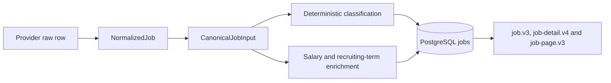

# Job Data Taxonomy and Display Contract

This is the stable vocabulary reference for public job data. Processing details are in [Domain and Data Normalization](modules/domain-normalization.md); API shape is in [Data API](DATA_API.md).

## Design rules

1. Preserve source values and make derived fields recomputable.
2. Keep opportunity type and work schedule as independent dimensions.
3. Use the title to determine the primary role category; use the JD for skills and requirements.
4. Version every derived classification with `classification_version`.
5. Filter by structured fields, never by presentation-only `display_tags`.
6. Keep provider payloads out of public job responses.

## Data layers

## Core display fields

| Field | Meaning |
|---|---|
| `id` | Public UUID |
| `title` | Display title |
| `company_name` | Display company name |
| `location` | Source text plus normalized hierarchy |
| `work_mode` | `onsite`, `hybrid`, `remote`, or `unknown` |
| `opportunity_type` | Opportunity nature |
| `schedule_types` | All schedule matches |
| `primary_schedule_type` | Concise schedule value |
| `job_category` | One primary category |
| `job_subcategories` | Confirmed role directions |
| `skill_tags` | Normalized technologies/tools |
| `source_skills` | Skills supplied verbatim by source adapters (detail response only) |
| `requirement_tags` | Normalized constraints/requirements |
| `display_tags` | Short presentation summary |
| `salary` | Original interval plus annualized values |
| `date_posted` | Provider date, possibly absent |
| `published_at` | Stable feed-sort timestamp |
| `sources` | All source/application links on detail |

## Opportunity values

`opportunity_type` values are `internship`, `co_op`, `new_grad`, `apprenticeship`, `regular`, `contract`, `temporary`, `seasonal`, and `unknown`.

`schedule_types` values are `full_time`, `part_time`, `flexible`, and `unknown`. A job can be `co_op` and `full_time` simultaneously. `primary_schedule_type` is selected for concise use while all detected values remain available.

## Job categories

The current `job_category` vocabulary is:

`software_engineering`, `data_ai`, `cybersecurity`, `cloud_devops`, `qa_testing`, `product_design`, `product_management`, `it_support`, `hardware_embedded`, `research`, `business_operations`, `finance`, `marketing_sales`, `human_resources`, `healthcare`, `education`, `skilled_trades`, `engineering`, `architecture_planning`, `legal`, `customer_service`, `supply_chain`, `administrative`, and `other`.

Category rules are deterministic and ordered so specific cybersecurity/data/cloud/hardware roles are considered before broad software/engineering matches. A React or Python mention in an unrelated role becomes a skill, not a category override.

## Location hierarchy

The structured hierarchy is `country → region → city`. Canada and the United States use normalized country codes and region codes; Canadian regions include provinces and territories, while US regions include states and DC. Common aliases and known misspellings are normalized. `region_type` is `province`, `territory`, `state`, or `region`.

`location.text` retains the source text. `location.display_name`, country, region, and city provide structured rendering/filtering. Remote/worldwide text is represented by work mode/location normalization rather than a fabricated city.

## Skills and requirements

Skill tags normalize common languages, frontend/backend frameworks, cloud/platform tools, data stores, AI libraries, engineering tools, analytics tools, and collaboration tools. Source skills and JD-extracted skills are merged and deduplicated.

Requirement tags cover visa sponsorship, security clearance, driver licence, travel, relocation, weekend shifts, and evening shifts when the text provides a reliable signal. An unmentioned requirement is not treated as false.

## Salary

Salary has `interval`, `minimum`, `maximum`, `currency`, `source`, `annualized_minimum`, and `annualized_maximum`. Annualization uses 2,080 hours/year, 260 days/year, 52 weeks/year, or 12 months/year. Annual/yearly uses multiplier 1.

Structured provider compensation is preferred; description regex and cached/DeepSeek enrichment handle missing values. Invalid or implausible amounts are omitted rather than displayed as zero. The database validates interval/amount consistency and annual min/max order.

## Dates and source links

`date_posted` is the provider’s date. `published_sort_at` is always populated for stable ordering and falls back to the first-seen timestamp when the provider date is absent. `first_seen_at` and `last_seen_at` describe platform visibility. Details return all source URLs and direct application URLs without raw payloads.

## Field-state interpretation

| State | Meaning |
|---|---|
| `unknown` enum | classifier had insufficient reliable evidence for that dimension |
| `null`/absent optional value | source and deterministic enrichment did not produce a valid value |
| empty tag list | no versioned taxonomy match was established |
| source text plus partial hierarchy | display evidence exists while some location levels remain unresolved |
| multiple `sources` on detail | cross-source dedupe attached provider identities to one canonical job |

Consumers must render these states as unknown/unavailable evidence, not as a
negative claim. Filters operate on normalized fields; source text remains the
display/audit evidence.
