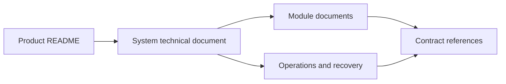

# WeCanFindIntern Documentation

This index contains the technical documentation for the delivered repository.
Every linked document describes the current implementation and its executable
contracts.

## Reading paths

| Need | Start here | Continue with |
|---|---|---|
| Understand the complete system | [Technical Documentation](TECHNICAL_DOCUMENTATION.md) | Relevant module guide |
| Install and run development mode | [Operations and Verification](modules/operations.md) | [Database and Data API](modules/database-and-data-api.md) |
| Build or operate the packaged app | [Desktop Application](DESKTOP.md) | [Reliability and Recovery](RELIABILITY_AND_RECOVERY.md) |
| Diagnose an interrupted or partial operation | [Reliability and Recovery](RELIABILITY_AND_RECOVERY.md) | Owning module guide |
| Integrate with public job data | [Data API](DATA_API.md) | [Job Data Taxonomy](JOB_DATA_TAXONOMY.md) |
| Change a subsystem | Owning module guide | Source paths and verification section in that guide |

## System and operations

| Document | Scope |
|---|---|
| [Technical Documentation](TECHNICAL_DOCUMENTATION.md) | Runtime topology, ownership boundaries, cross-module data flows, concurrency, security, and end-to-end scenarios |
| [Operations and Verification](modules/operations.md) | Setup, migrations, application startup, collection, scheduling, maintenance, and acceptance commands |
| [Desktop Application](DESKTOP.md) | Electron lifecycle, embedded PostgreSQL/FastAPI, local data, secure storage, backups, platform builds, and recovery |
| [Reliability and Recovery](RELIABILITY_AND_RECOVERY.md) | Outcome classification, retry rules, idempotent reruns, transaction boundaries, concurrency conflicts, and recovery actions |

## Module documentation

| Module | Delivered implementation covered |
|---|---|
| [Job Ingestion](modules/job-ingestion.md) | JobSpy boundary, catalog expansion, paging, retry, scope filtering, normalization handoff, persistence, and enrichment |
| [Domain and Data Normalization](modules/domain-normalization.md) | Canonical model, text/location/work-mode normalization, classification, salary, recruiting term, and dedupe inputs |
| [Database and Data API](modules/database-and-data-api.md) | PostgreSQL schema, migrations, repositories, query construction, cursor pagination, facets, and transaction behavior |
| [WaterlooWorks](modules/waterlooworks.md) | Dedicated Chrome, SSO/MFA boundary, five-board collection, SQLite, application sync, Tracker handoff, and API |
| [Profile and Resume Import](modules/profile.md) | `profile.v1`, PDF/LaTeX security, parsing, draft review, confirmation, persistence, and API |
| [Application Tracker](modules/tracker.md) | Source identities, bookmarks, stages, snapshots, events, bulk actions, export, and Agent integration |
| [AI Agent and Memory](modules/ai-agent.md) | Tool catalog, recommendations, bounded planning, approvals, streaming, audit, summaries, memory, and recovery |
| [ATS-Style Resume Diagnostics](modules/ats-review.md) | Deterministic parsing readiness and resume/job matching with evidence and formulas |
| [LLM-Assisted Career Tools](modules/llm-assisted-tools.md) | Shared provider gateway, ATS commentary, cover letters, interview sessions, STT/TTS, caching, and failure handling |
| [Frontend](modules/frontend.md) | Static application shell, native ES modules, navigation, API/SSE integration, rendering safety, and state |

The compact [module index](modules/README.md) is useful when working entirely
inside `src/wecanfindintern/` or `web/`.

## Contract references

| Reference | Contract |
|---|---|
| [Data API](DATA_API.md) | Public job routes, filters, pagination, responses, and performance behavior |
| [Job Data Taxonomy](JOB_DATA_TAXONOMY.md) | Current canonical vocabulary and display semantics |
| [JobSpy Integration](JOBSPY_INTEGRATION.md) | Vendored source baseline, stable DataFrame boundary, query restrictions, and upgrade verification |
| [Database Migrations](../migrations/README.md) | Ordered migration runner, checksums, extensions, partitions, and deployment rules |
| [Desktop Native Resources](../desktop/resources/README.md) | Platform resource directory contract used by Electron packaging |
| [`schemas/`](../schemas/) | Versioned JSON Schemas for the public job list/detail/facets contracts |

## Authority and update rule

Runtime code, SQL migrations, versioned schemas, route models, configuration,
and executable checks are the implementation evidence. Documentation changes
must update the system guide, owning module guide, contract reference, and
operator procedure together when a change crosses those boundaries. Every
statement must remain traceable to that current evidence.
