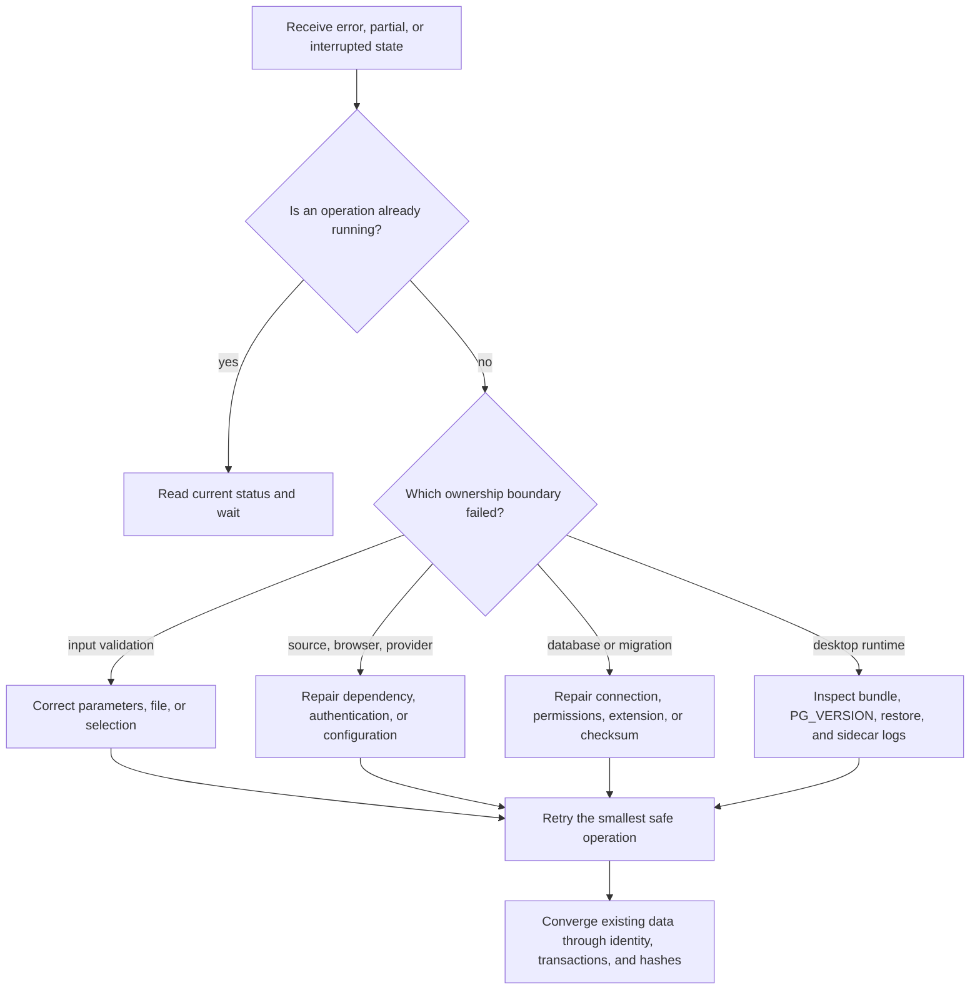

# Reliability, Concurrency, and Recovery Runbook

This runbook is the operational reference for abnormal outcomes. It distinguishes
retry, idempotent rerun, partial success, and rollback instead of treating every
failure as the same event. Network and model operations use bounded retries.
Database writes use short transactions. Committed campaign data remains in
place, and later runs converge through unique keys, input hashes, and source
identity.



## 1. Failure classification

| Category | Typical signal | Automatic retry | User/operator action |
|---|---|---:|---|
| Valid empty result | JobSpy returns an empty page without an ERROR | no | treat it as a successful empty page |
| Transient upstream failure | timeout, connection error, JobSpy logger ERROR | yes | wait through backoff; inspect the source failure after exhaustion |
| Permanent input error | 422 or invalid source/filter/file | no | correct the input and resubmit |
| One malformed record | missing field, unknown location, parse failure | usually no | preserve usable fields and record the row/posting failure |
| Database or migration failure | `/health` failure or migration checksum mismatch | bounded within current operation | repair database, version, or permissions before writes continue |
| Provider configuration error | missing key/model/base URL | no | complete Settings and resubmit |
| Provider transport error | 5xx, network failure, rate limit | bounded gateway retry | use the feature fallback if retries are exhausted |
| Provider output error | malformed JSON or schema rejection | no | retain deterministic output or return a safe error |
| Concurrency conflict | file lock, pending approval, unique conflict | scenario-dependent | reuse current state or retry later |

## 2. Public job campaign

### 2.1 Execution stages

1. Read and expand the catalog. Configuration errors fail before the network
   stage.
2. Create one independent query task per enabled definition/source and bound
   concurrency with the semaphore.
3. Select a durable full or rolling 48-hour sweep. The first run and every tenth
   completed interval thereafter are full sweeps.
4. Call JobSpy for each page and deduplicate within the query by fingerprint.
   LinkedIn IDs are deduplicated across queries before cached/stale details are
   hydrated.
5. Finish all network tasks before creating the ingestion run and writing
   canonical records.
6. Ingest into PostgreSQL by `batch_size`, with one transaction per batch.
   Identical payloads use one set-based timestamp refresh per batch.
7. Run salary and recruiting-term enrichment after deduplication, skipping
   definitive results already checked against the same content hash.
8. Persist the run summary and its `success` or `partial` status.

### 2.2 Retry formula

The default permits `max_retries=3` additional attempts per page. Retry number
`n` waits:

```text
min(15s, 1.5s × 2^(n-1) + random jitter[0.5s, 2.0s])
```

The retry wraps an individual JobSpy query rather than the whole campaign, so
one failing source does not cancel successful sources. `scrape_checked()` raises
an error when JobSpy returns an empty table after logging an error, preventing a
false successful-empty result.

### 2.3 Interruption and safe rerun

The campaign uses a restart-from-source recovery model. Offsets,
`seen_for_query`, and current query results are per-process state. After an
interruption, rerun the campaign:

- committed batches update or remain unchanged through source fingerprints and
  unique constraints;
- advisory locks serialize the same dedupe block;
- an identical raw payload does not create another snapshot;
- missing enrichment output cannot clear a valid salary or recruiting term;
- queued queries restart from their first page.

A recovery run can revisit an upstream source and consume additional network
capacity, but an old offset cannot skip current results. Do not delete the lock
file to clear a supposed checkpoint. The lock is process-level mutual exclusion,
not a progress file.

### 2.4 Campaign outcome

- Every query succeeds, including valid empty pages: `success`.
- At least one query exhausts retries and the database stage completes:
  `partial`, with failures retained in the summary.
- A database, migration, or unrecoverable pipeline error marks the run failed or
  partial and returns a nonzero command status. Previously committed batches
  remain.
- Enrichment failure does not undo the canonical job. Statistics record the
  failure, and later processing selects it again by missing value or input hash.

## 3. Database transactions and rollback

### 3.1 Transaction rollback boundaries

An individual repository mutation, ingest batch, dedupe write, Tracker
event-plus-snapshot update, Profile apply, and Agent approval execution each own
a transaction boundary. An exception rolls back SQL inside that boundary.
Other committed batches and requests remain committed.

### 3.2 Point-in-time recovery

A source or enrichment failure does not delete jobs already stored by the
campaign and does not restore the whole database to campaign start. Point-in-time
recovery uses a desktop backup/restore or a database-administrator procedure.
Create a backup of the current state before beginning that recovery.

### 3.3 Database troubleshooting

1. Call `/health` and confirm that `SELECT 1` succeeds through the pool.
2. Check migration checksums, the `vector`, `pgcrypto`, and `pg_trgm` extensions,
   and database-user permissions.
3. Inspect `database_stats`, run status, and logs in the campaign summary.
4. For statement timeouts, reduce batch/concurrency or optimize SQL before
   increasing retry counts.
5. Rerun after repair and rely on idempotent keys. Preserve the `jobs` table.

## 4. Recommendation index queue

A database trigger enqueues job changes in `recommendation_index_queue`. The
maintenance loop reads the queue in pages:

- only rows with `attempts < 5` are selected again;
- indexing or embedding errors set `last_error` and increment `attempts`;
- a poison row does not block other jobs in the batch;
- an exhausted row remains available for inspection, and a later job update
  resets its attempts;
- without embedding configuration, the lexical document remains available and
  deterministic/lexical recommendation continues;
- embedding failure does not delete current documents or chunks.

Repair the provider, base URL, model, or dimensions before updating or
reenqueuing the affected job. Use targeted maintenance and backfill commands only
after identifying damaged derived data.

## 5. WaterlooWorks recovery

WaterlooWorks processes boards sequentially and isolates posting failures within
each board. SQLite enables foreign keys and a 30-second busy timeout. A posting
is inserted once by external Job ID; later observations update only
`last_seen_at`.

| Scenario | Current state | Recovery action |
|---|---|---|
| User is signed out | `waiting_for_login` | complete SSO/MFA in the dedicated Chrome profile, then refresh status |
| Chrome is closed | `idle` with closed-browser message | launch again, sign in, and collect again |
| One board fails | run is `partial`; other boards remain | repair page/connectivity and collect all boards again |
| One posting fails | board error/count increases; other postings remain | run a complete collection; known Job IDs stay idempotent |
| Collector is cancelled | run is failed/cancelled | collect again using the full-board restart model |
| Application detail API fails | list fields remain; description failure is recorded | run application sync again; Tracker records remain |

WaterlooWorks SQLite and PostgreSQL use separate source namespaces. Recovery
keeps that storage isolation intact.

## 6. LLM and deterministic fallback

| Feature | Primary path | Fallback or termination | Data effect |
|---|---|---|---|
| Salary | structured source data | regex, then DeepSeek; unresolved stays absent | valid current salary remains |
| Recruiting term | cache, then regex | DeepSeek; failure records the generation | later selection uses changed hash or unfinished state |
| Recommendation | lexical + vector | lexical/skill overlap without vector | the model cannot invent candidates |
| ATS score/match | deterministic | independent of LLM | provider failure cannot remove the score |
| ATS commentary | LLM | retain deterministic score and report commentary error | primary score remains unchanged |
| Cover Letter | Writer/Reviewer, at most five rounds | return the final nonempty draft marked unapproved | user reviews it; system does not claim approval |
| Interview STT | local faster-whisper | typed answer wins; empty/no-speech input returns a readable error | audio upload to an LLM is not required |
| Agent plan | bounded JSON plan | safe assistant reply and no write | invalid output cannot trigger approval or mutation |

The shared gateway retries transport failures within configured bounds. It does
not retry JSON or business-validation failures. Cache lookup/store failure is
treated as a cache miss and does not block the primary feature.

## 7. Electron desktop recovery

Check desktop startup failures in this order:

1. Confirm the Electron single-instance state and packaged resources.
2. Confirm the PostgreSQL bundle contains
   `postgres/initdb/pg_ctl/pg_isready/createdb/psql` and `vector.control`.
3. Confirm `PG_VERSION` is 16. A major-version mismatch stops startup.
4. Confirm the sidecar prints `ready` within 60 seconds.
5. Confirm the loopback token, `WCFI_USER_DATA_DIR`, `WCFI_RESOURCE_DIR`, and
   `DATABASE_URL` are present.
6. Check whether migration checksum or extension permissions stopped startup.

PostgreSQL backup restore follows these rules:

- create a safety backup before a manual restore;
- automatically roll back to the safety backup if restore fails;
- restore replaces PostgreSQL data only, leaving WaterlooWorks, Chrome, models,
  and secrets intact;
- restart after restore so migrations execute before the API listens;
- use compatible backup/restore or `pg_upgrade` for a major-version change; never
  point a newer server directly at the older data directory.

## 8. Concurrency conflict handling

- `campaign already running`: identify the current manual, scheduled, or desktop
  task and wait for it instead of starting another campaign.
- Agent approval conflict: an approval can leave `pending` once. Refresh the list
  to read its final state and do not repeat the write.
- Tracker unique conflict: read the current row by source/job identity. A repeated
  Interested action is an idempotent success.
- SQLite busy or Chrome target conflict: wait for the current WaterlooWorks task
  and confirm that the browser remains connected.
- Pool exhaustion or timeout: reduce API worker count, pool maximum, collection
  batch size, or concurrency, and inspect slow SQL.

## 9. Evidence and logs

Public collection writes status, query/database/enrichment statistics, and a
bounded failure list to `logs/campaign_summary_latest.json`. Desktop mode writes
logs under the user-data `logs/` directory. Collection status is replaced
atomically. If startup reads a previous `running=true` state, it reports the run
as interrupted and schedules the next complete run.

Logs exclude API keys, passwords, MFA data, cookies, and complete resumes. For
troubleshooting, collect timestamps, run ID, source, board, attempts,
`last_error`, and HTTP status without copying raw secrets into an issue.
