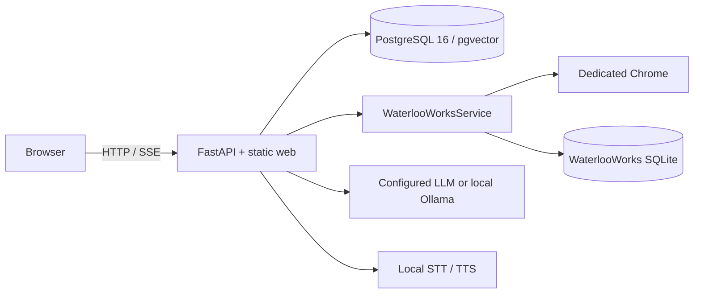
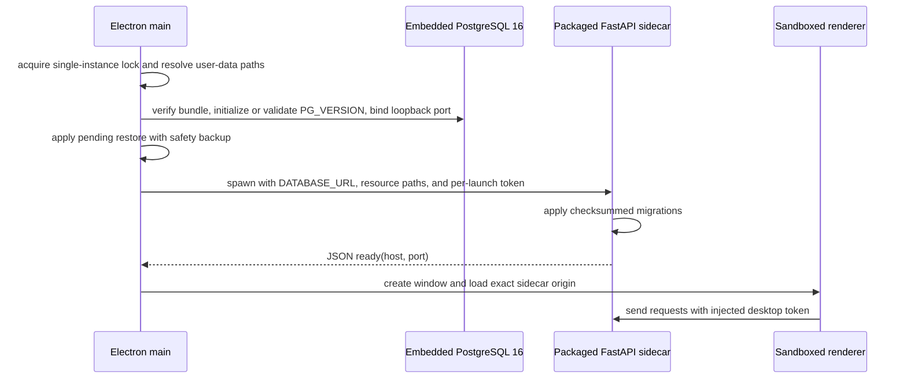
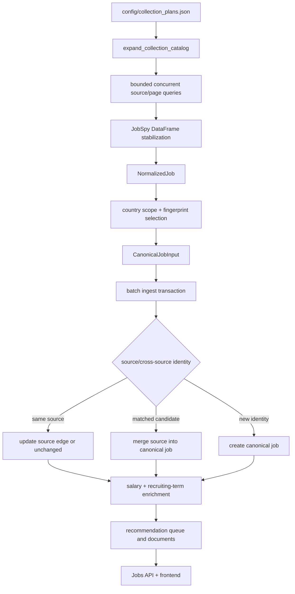
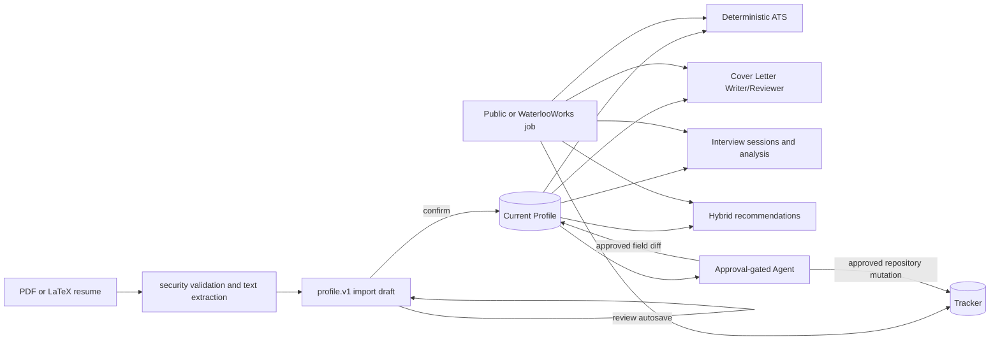
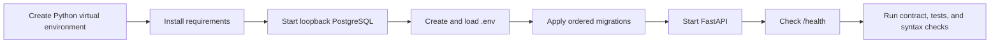

# WeCanFindIntern Technical Documentation

This document describes the system boundaries, runtime topology, data ownership,
end-to-end flows, concurrency and recovery semantics, security model, and
acceptance entry points of the delivered repository. Detailed algorithms and
module operations live under [`docs/modules/`](modules/README.md). Operational
failure handling lives in the [Reliability and Recovery Runbook](RELIABILITY_AND_RECOVERY.md).

## 1. System scope

WeCanFindIntern is a local-first, single-user career workspace. The delivered
system includes:

- public job collection from Indeed, LinkedIn, Glassdoor, ZipRecruiter, and
  Google Jobs through the vendored JobSpy package, followed by normalization,
  classification, cross-source deduplication, enrichment, and public querying;
- collection from five WaterlooWorks boards through a dedicated local Chrome
  session, including submitted-application status synchronization;
- `profile.v1`, safe resume import, deterministic ATS diagnostics, cover-letter
  generation, interview practice, and an Application Tracker;
- an approval-gated AI Agent, hybrid job recommendations, audit records,
  session summaries, long-term memory, and explicit preferences;
- a FastAPI and static ES-module browser/development runtime, plus macOS and
  Windows desktop runtimes built with Electron and embedded PostgreSQL/Python
  sidecars.

Source pages, raw provider payloads, browser authentication state, and normalized
business data belong to separate ownership boundaries. Public jobs and
WaterlooWorks preserve their own source identities. Cross-module relationships
use a public UUID or WaterlooWorks Job ID instead of copying or guessing identity.

## 2. Repository and component boundaries

```text
src/wecanfindintern/
├── api/                 FastAPI assembly, dependencies, models, and routes
├── ingestion/           JobSpy adapter, catalog, pipeline, and enrichment
├── domain/              normalization, classification, salary, location, contracts
├── db/                  PostgreSQL pool, public reads, ingestion repositories
├── waterlooworks/       Chrome control, extraction, SQLite, sync, state machine
├── profile/             profile.v1, resume parsing, validation, persistence
├── ats/                 deterministic parsing and match diagnostics
├── cover_letter/        Writer/Reviewer generation and DOCX/PDF export
├── interview/           sessions, questions, STT, TTS, analysis, history, trends
├── tracker/             application state, events, and source identity
├── agent/               planning, tools, approval, recommendations, and memory
├── llm/                 provider gateway, JSON, streaming, and cache
└── desktop/             sidecar, paths, migrations, tokens, background collection

web/                     HTML, CSS, and native ES modules
desktop/                 Electron main/preload, PostgreSQL, backup, and packaging
migrations/              ordered PostgreSQL migrations
schemas/                 versioned public job JSON Schemas
scripts/                 collection, maintenance, desktop build, verification
config/                  collection catalog and operating-system scheduler config
vendor/JobSpy/           pinned local JobSpy source
tests/                   unit, route, repository, integration, and contract evidence
```

Business dependencies flow from `API/scripts → service/application →
domain/repository`. Provider DataFrames remain inside the ingestion boundary.
Repositories and migrations own SQL. LLMs return validated content or tool plans
and never receive a database connection.

## 3. Runtime topology

### 3.1 Browser and development runtime



`.env` supplies `DATABASE_URL` and optional provider/index settings. Docker
Compose supplies development PostgreSQL bound to `127.0.0.1:5432`. The FastAPI
lifespan opens the asynchronous psycopg pool, Agent memory manager,
WaterlooWorks service, and recommendation-index maintenance loop. Shutdown
cancels background work and closes each owned resource.

### 3.2 Electron desktop runtime



The renderer enables the Chromium sandbox and context isolation and has no
Node.js access. Preload exposes only allowlisted IPC for version information,
collection status, backup/restore, and AI secrets. PostgreSQL and FastAPI bind
random loopback ports. FastAPI middleware validates a per-launch token on
`/health`, `/api/`, and `/desktop/` requests. Electron `safeStorage` encrypts AI
keys. The [Desktop Application guide](DESKTOP.md) documents directories,
packaging, backup, and recovery.

## 4. Data ownership

| Data | Authoritative store | Public/module identity | Boundary and retention rule |
|---|---|---|---|
| Current public jobs | PostgreSQL `jobs` | public UUID | API returns canonical fields and excludes raw payloads |
| Public source edges | PostgreSQL `job_sources` | source + fingerprint/job ID | detail returns source links; unique indexes enforce idempotency |
| Raw collection snapshots | partitioned `raw_job_snapshots` | payload hash + scrape time | written when payload changes for audit and recomputation |
| Classification/recommendation derivatives | PostgreSQL job/recommendation tables | algorithm/document/profile version | rebuildable from canonical and source data |
| Profile and resume imports | PostgreSQL profile/resume/import tables | profile/section/resume/import UUID | current profile and review draft are separate; confirmation is atomic |
| Tracker | PostgreSQL tracker/event tables | application UUID + public/external identity | user stage remains separate from external source status |
| Agent, approvals, and memory | PostgreSQL Agent tables | session/message/tool/approval UUID | original arguments, single decision, incremental summary/memory watermarks |
| LLM cache | PostgreSQL `llm_cache` | provider/model/prompt content hash | TTL cleanup; cache errors behave as misses |
| WaterlooWorks postings and runs | user-directory SQLite | WaterlooWorks Job ID | excluded from public jobs and public cross-source deduplication |
| WaterlooWorks SSO/MFA/cookies | dedicated Chrome profile | browser profile | excluded from PostgreSQL, SQLite, Agent context, and logs |
| Desktop secrets, backups, and logs | operating-system app-data directory | local files | encrypted secrets; PostgreSQL and WaterlooWorks backups remain separate |

## 5. Public job end-to-end flow



Implementation rules:

1. `JobSpyQuery` validates the source, offset, result count, and mutually
   exclusive provider filters before an upstream call.
   `stabilize_jobspy_frame()` supplies the fixed column contract for zero-row or
   zero-column results.
2. `NormalizedJob` retains a cleaned raw row and converts downstream fields to
   provider-neutral types. Raw data enters only the snapshot boundary.
3. Each query deduplicates with an in-memory fingerprint set. When concurrent
   queries produce the same fingerprint, selection prefers stronger structured
   salary data and then the longer description.
4. Fingerprints and unique indexes establish source-level identity. Cross-source
   deduplication selects at most 25 candidates by direct URL, company/location
   block, and a ±60-day publication window, then compares title, location/work
   mode, date, and five-token description shingles.
5. Each ingest batch writes the canonical job, source edge, snapshot, and dedupe
   evidence in one transaction. Related dedupe blocks use transaction-scoped
   advisory locks.
6. Salary precedence is provider-structured data, regex, then DeepSeek.
   Recruiting-term precedence is content cache, regex, then DeepSeek. Invalid
   results do not overwrite valid current values.
7. A job trigger writes `recommendation_index_queue`. Background maintenance
   produces lexical documents/chunks before filling the primary vector for the
   configured embedding profile.

## 6. Candidate and application flow



- PDF and LaTeX inputs pass extension, MIME/magic/structure, size, active
  content, extraction, and English-text checks. LaTeX is parsed as text and is
  never compiled or executed.
- Import drafts and the current profile are persisted separately. Review
  autosave changes only the draft. Confirmation applies the profile and updates
  import/resume status within one transaction.
- ATS parsing readiness and resume/job match scores are deterministic. LLM
  commentary cannot replace or modify either score.
- Cover Letter runs at most five Writer/Reviewer rounds, reports grounding
  status, issues, and unsupported claims, and exports DOCX or PDF.
- Interview questions and analyzed answers belong to a persisted session. A
  typed answer takes precedence over a local faster-whisper transcript. TTS uses
  local synthesis or gTTS according to configuration.
- Tracker stores the current application snapshot and event history. Public
  UUIDs, WaterlooWorks Job IDs, and custom records preserve distinct identities.
  External status never overwrites the user's workflow stage.

## 7. Agent and recommendation flow

```mermaid
sequenceDiagram
    participant U as User
    participant O as Agent orchestrator
    participant M as LLM planner
    participant T as Typed tool
    participant DB as Repository
    U->>O: message + provider configuration
    O->>DB: persist message and load profile, window, summary, and recall
    loop up to 4 planning rounds
        O->>M: tool catalog + delimited context/results
        M-->>O: validated JSON reply or one tool step
        alt read tool
            O->>T: validate arguments and execute bounded read
            T->>DB: repository or service query
            DB-->>O: bounded result for next round
        else write tool
            O->>DB: persist exact arguments and preview as pending approval
            O-->>U: approval card; planning stops
        end
    end
    U->>O: approve or deny
    O->>DB: atomically decide pending approval
    O->>T: execute persisted arguments only when approved
    O-->>U: audited final result
```

Recommendations rank only public or WaterlooWorks candidates retrieved from
repositories; the model cannot create jobs. Retrieval combines lexical rank,
skill and requirement overlap, location/work mode, recency, optional vector
similarity, and optional LLM reranking. Lexical documents and deterministic
scoring keep recommendations available when the embedding provider is
unavailable. Tracked records can be removed after candidate retrieval.

Agent tool arguments use Pydantic models. Read tools execute immediately. Write
tools create pending approvals. Each approval stores the original tool name,
validated arguments, and preview; only the first `pending → approved/denied`
decision succeeds. Duplicate calls, ambiguous job references, invalid arguments,
malformed plans, and provider errors terminate before mutation.

## 8. API, UI, and outcome handling

FastAPI registers API routes before mounting the static frontend at `/`. The
delivered route families are:

```text
/health                         database connectivity
/api/v1/jobs                    public jobs, facets, geo distribution, detail
/api/v1/ats                     deterministic diagnostics and commentary
/api/v1/cover-letter            generation, SSE progress, export
/api/v1/interview               sessions, SSE, questions, TTS, analysis, trends
/api/v1/profile                 profile, resume imports, and drafts
/api/v1/resumes                 shared PDF extraction
/api/v1/tracker                 bookmarks, applications, events, bulk, CSV
/api/v1/waterlooworks           Chrome status, collect, jobs, application sync
/api/v1/agent                   sessions, stream, approvals, preferences, memory
/desktop                        local collection status and trigger
```

| Scenario | Server semantics | Client/operator action |
|---|---|---|
| Normal list | 200 with items/cursor or page metadata | render and retain the next cursor/page |
| Valid empty result | 200 with empty items | show the empty state without marking failure |
| Invalid filter, body, or file | FastAPI/Pydantic/domain validation returns 422 | preserve input and show corrective detail |
| Missing UUID or record | 404 | refresh the list or select a stable identity again |
| Background operation already active | 409 or current running state | wait for or reuse the active operation |
| One source, board, or posting fails | record failure; isolated work continues; result may be partial | inspect per-source/per-board summary and rerun |
| Request or process interruption | uncommitted transaction rolls back; committed state remains | run the module's idempotent full retry or resubmit |
| LLM configuration, transport, or output error | no mutation; deterministic result or current draft remains | correct key/model/base URL or retry the feature |
| Repeated approval decision | first result remains; later decision conflicts | refresh session and approval state |
| Missing or invalid desktop token | 401 | reload through the Electron renderer and current sidecar origin |

The frontend uses native ES modules, lazy section loading, `fetch`, and SSE.
Ordinary dynamic text passes through `escapeHtml()`. Markdown and generated text
use the shared renderer. Source URLs and IDs are validated before use. Failed
list/detail requests do not advance cursors. SSE converges through its final
event. After Tracker or approval writes, the client rereads authoritative server
state.

## 9. Concurrency, transactions, and recovery semantics

| Unit | Concurrency/transaction boundary | Idempotency or conflict protection |
|---|---|---|
| Public collection query | `asyncio.Semaphore`, default 4, CLI range 1–16; JobSpy runs in threads | per-query fingerprints and isolated source failures |
| Collection process | nonblocking Unix `fcntl` or Windows `msvcrt` file lock | manual, scheduler, and desktop modes share the lock |
| PostgreSQL request | async pool default 2–20; statement timeout default 5 seconds | each repository mutation/transaction rolls back independently |
| Ingest batch | one transaction per batch | unique identity plus advisory transaction lock |
| Enrichment | regex first; bounded model concurrency/batches | input/content hashes; empty output cannot clear valid values |
| WaterlooWorks | service task lock; sequential boards; isolated posting failures | insert-once Job ID; repeats update only `last_seen_at` |
| Recommendation index | paged queue; per-item errors record attempts | `attempts < 5`; a job update resets the item |
| Agent turn | up to four planning rounds plus feedback budget | duplicate-call guard and single approval transition |
| Tracker/Profile writes | repository transaction | unique source identity; atomic current row plus event/draft |
| Desktop backup | one backup promise; custom-format temp file then rename | safety backup before restore and automatic rollback on failure |

Public collection uses restart-from-source instead of a persistent page
checkpoint. After a process interruption, collection restarts from the catalog
and query origin. Source fingerprints, unique constraints, payload hashes, batch
transactions, and dedupe locks converge already committed data. WaterlooWorks
reruns complete boards rather than restoring an old DOM offset. The
[Reliability and Recovery Runbook](RELIABILITY_AND_RECOVERY.md) contains the
backoff formula, partial-result rules, and failure matrices.

## 10. Security model

- The desktop renderer uses sandboxing, context isolation, and a restricted
  preload. Network access targets only the exact sidecar origin, and the main
  process injects a per-launch token.
- The sidecar permits `127.0.0.1` and `::1` only. PostgreSQL uses a random
  loopback port, a SCRAM password, and a private desktop data directory.
- Electron `safeStorage` encrypts provider keys and the PostgreSQL password.
  API keys, passwords, MFA data, and cookies stay out of Profile, Agent memory,
  and ordinary logs.
- WaterlooWorks authentication remains in the dedicated Chrome profile. The API
  and SQLite store extracted posting/application data and never store cookies.
- Resume uploads are checked for type, magic, structure, active content, size,
  and text limits before parsing. LaTeX is not executed, and unsafe PDF/LaTeX
  input is rejected.
- Provider and job text enters prompts in delimited data blocks. Model output
  passes JSON, schema, and domain validation. Repositories alone own SQL and
  mutations.
- Desktop restore, Tracker bulk deletion, and resume deletion require explicit
  user actions and use transactions, confirmation, or safety backups to bound
  impact.

## 11. Installation, migration, runtime, and acceptance

The authoritative development sequence is:



The [Operations and Verification guide](modules/operations.md) contains exact
commands, macOS launchd and Windows Task Scheduler procedures, maintenance
scripts, and result interpretation. Database migrations run through
`scripts/maintenance/migrate.py` in filename order. The runner stores filename
and checksum in `schema_migrations` and rejects changes to an applied file.

Repository acceptance entry points:

```bash
make check
.venv/bin/ruff format --check src tests scripts
PYTHONPATH=src .venv/bin/python scripts/dev/verify_data_api_contract.py
git diff --check
```

`make check` runs Ruff, pytest, the frontend/API route contract verifier, and
Node syntax checks for every `web/modules/*.js` file. Integration tests marked
`db` require a migrated PostgreSQL database. Documentation records repeatable
gates rather than expiring test counts, historical commit IDs, or one-time run
results.

## 12. Authoritative module and reference documents

- [Job Ingestion](modules/job-ingestion.md)
- [Domain and Data Normalization](modules/domain-normalization.md)
- [Database and Data API](modules/database-and-data-api.md)
- [WaterlooWorks](modules/waterlooworks.md)
- [Profile and Resume Import](modules/profile.md)
- [ATS-Style Resume Diagnostics](modules/ats-review.md)
- [LLM-Assisted Career Tools](modules/llm-assisted-tools.md)
- [Application Tracker](modules/tracker.md)
- [AI Agent and Memory](modules/ai-agent.md)
- [Frontend](modules/frontend.md)
- [Operations and Verification](modules/operations.md)
- [Desktop Application](DESKTOP.md)
- [Reliability and Recovery](RELIABILITY_AND_RECOVERY.md)
- [Data API](DATA_API.md)
- [Job Data Taxonomy](JOB_DATA_TAXONOMY.md)
- [JobSpy Integration](JOBSPY_INTEGRATION.md)
- [Database Migrations](../migrations/README.md)
