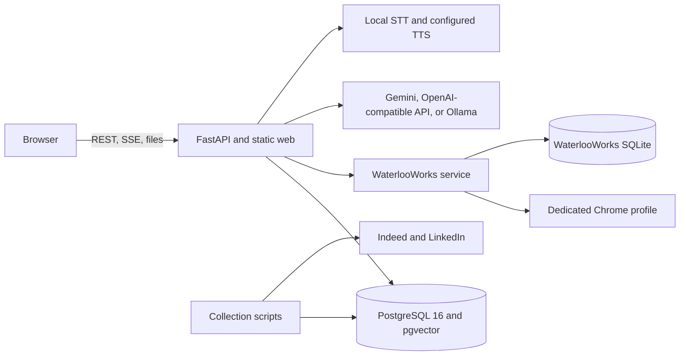
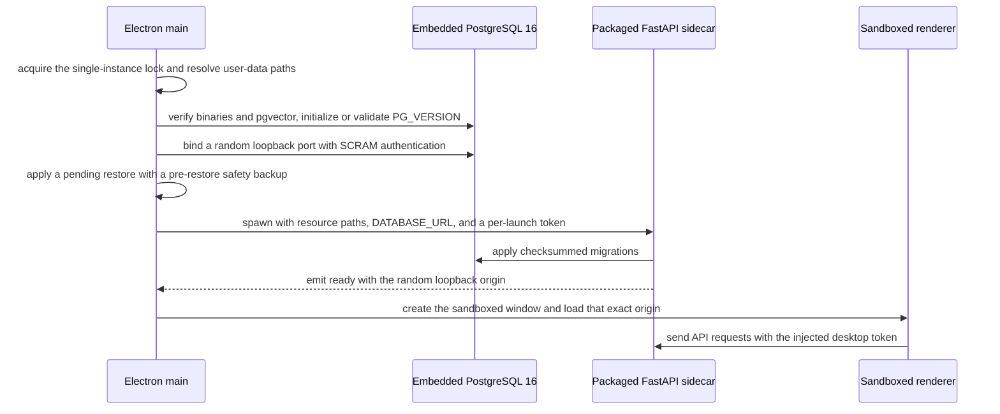
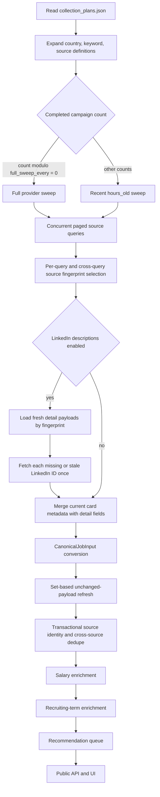
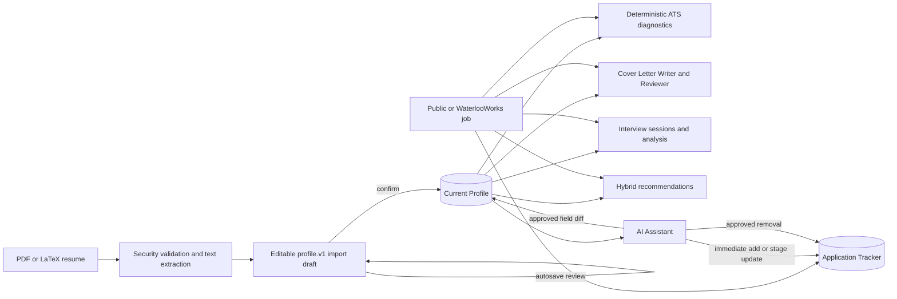
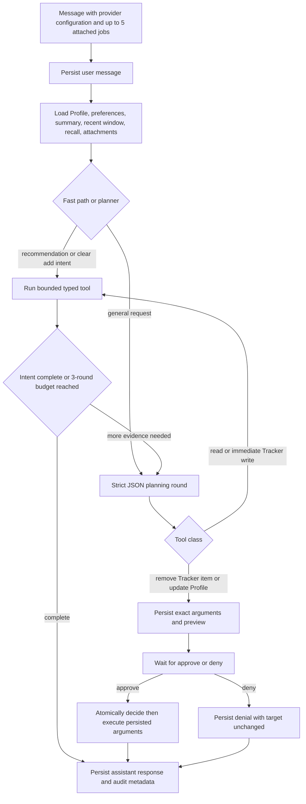
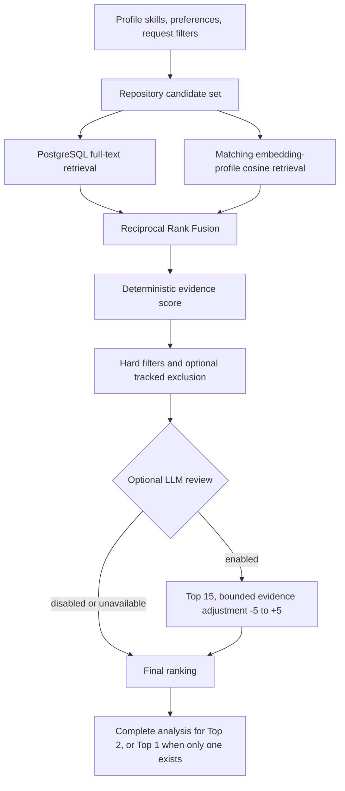
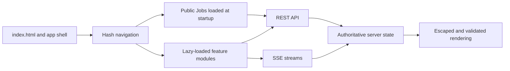
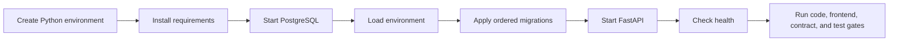

# WeCanFindIntern Technical Documentation

This document describes the delivered WeCanFindIntern 1.0.0 system: runtime
topology, ownership boundaries, end-to-end workflows, state transitions,
concurrency, recovery, security, and verification. Module-level algorithms and
route details are linked from the final section.

## 1. Delivered system

WeCanFindIntern is a local-first, single-user career workspace with these
integrated capabilities:

- collection from Indeed and LinkedIn through the vendored JobSpy source;
- normalization, classification, cross-source deduplication, salary and
  recruiting-term enrichment, search facets, result counts, and geographic
  distribution;
- collection from five WaterlooWorks boards through a dedicated Chrome profile,
  plus submitted-application synchronization;
- a structured `profile.v1` candidate record and reviewed PDF/LaTeX resume import;
- deterministic resume parsing-readiness and resume-to-job diagnostics;
- cover-letter generation with a Writer/Reviewer grounding loop;
- persisted interview sessions with local speech-to-text, TTS, answer analysis,
  criteria results, history, and trends;
- a source-aware Application Tracker for public, WaterlooWorks, and custom jobs;
- an AI Assistant with job search, complete-JD analysis, multi-job comparison,
  hybrid recommendations, controlled mutations, audit history, and layered
  memory;
- a FastAPI/static-ES-module development runtime and packaged Electron runtimes
  for macOS and Windows with embedded PostgreSQL 16.

Public jobs and WaterlooWorks jobs retain separate source namespaces. A public
job is addressed by UUID; a WaterlooWorks job is addressed by its source Job ID;
a Tracker application has its own UUID and preserves the originating reference.

## 2. Repository boundaries

```text
src/wecanfindintern/
├── api/                 FastAPI assembly, dependencies, routes, request models
├── application/         API projections and cross-module application services
├── ingestion/           JobSpy adapter, catalog expansion, enrichment pipeline
├── domain/              normalization, classification, salary, location, identity
├── db/                  pool, public reads, ingestion/enrichment repositories
├── waterlooworks/       Chrome control, authenticated extraction, SQLite, sync
├── profile/             profile.v1, resume validation/parsing, persistence
├── ats/                 deterministic parsing and job-match diagnostics
├── cover_letter/        Writer/Reviewer workflow and DOCX/PDF export
├── interview/           sessions, questions, STT, TTS, analysis, trends
├── tracker/             application snapshots, stages, events, source identity
├── agent/               planning, tools, analysis, approval, recommendation, memory
├── llm/                 provider gateway, JSON parsing, prompts, shared cache
└── desktop/             sidecar server, migrations, security, resident collection

web/                     static HTML, CSS, and native ES modules
desktop/                 Electron main/preload, PostgreSQL, backups, packaging
migrations/              ordered, checksummed PostgreSQL schema migrations
schemas/                 exported public-job JSON Schemas
scripts/                 collection, maintenance, packaging, and verification
config/                  collection catalog and launchd configuration
vendor/JobSpy/           audited local JobSpy source
tests/                   unit, route, frontend, repository, and integration checks
```

Dependencies flow from routes and scripts into application services, domain
functions, and repositories. Provider DataFrames remain inside the ingestion
boundary. SQL is owned by repositories and migrations. LLM output passes typed
validation and receives neither a database connection nor browser credentials.

## 3. Runtime topology

### 3.1 Browser and development runtime



`Settings.from_env()` loads `DATABASE_URL`, pool sizes, and the statement timeout
from the environment or `.env`. Docker Compose supplies PostgreSQL/pgvector on
`127.0.0.1:5432`. FastAPI startup opens the async psycopg pool, Agent memory
manager, WaterlooWorks service, desktop collection service when desktop paths
are present, and the recommendation-index maintenance task. Shutdown cancels
background tasks before closing memory, WaterlooWorks, and the database pool.

### 3.2 Electron desktop runtime



The renderer has context isolation, Chromium sandboxing, and no Node.js access.
Preload exposes allowlisted IPC for version, collection, backup/restore, and AI
secret operations. Electron permits audio capture only for the sidecar origin,
opens only trusted HTTPS/mailto links externally, and blocks renderer navigation
away from the local origin. Closing the window keeps the tray runtime active.

## 4. Data ownership and identity

| Data | Authoritative store | Identity | Write rule |
|---|---|---|---|
| Public canonical job | PostgreSQL `jobs` | public UUID | current searchable projection, one row per canonical job |
| Public source edge | PostgreSQL `job_sources` | source fingerprint and source job ID | preserves source/direct URLs and detail freshness |
| Source observation | partitioned `raw_job_snapshots` | source edge, payload hash, scrape time | added only when the payload hash changes |
| Dedupe evidence | PostgreSQL dedupe tables | source/candidate pair | stores rule hits, score, version, and result |
| Derived search/recommendation data | PostgreSQL job and recommendation tables | algorithm/document/embedding profile | rebuildable from canonical source evidence |
| Profile and resume imports | PostgreSQL profile/resume/import tables | profile, section, resume, import UUIDs | current profile and review draft remain separate until confirmation |
| Application Tracker | PostgreSQL tracker/event tables | application UUID plus source identity | current snapshot and observable event write together |
| Agent and memory | PostgreSQL Agent tables | session/message/tool/approval/memory UUIDs | exact arguments, audit events, summaries, and watermarks are persisted |
| Shared LLM cache | PostgreSQL `llm_cache` | provider/model/prompt content hash | TTL-backed result cache; cache errors behave as misses |
| WaterlooWorks jobs and runs | user-data SQLite | WaterlooWorks Job ID | posting content is inserted once; freshness and new board edges can advance |
| WaterlooWorks authentication | dedicated Chrome profile | browser profile | SSO, MFA, and cookies remain in Chrome |
| Desktop secrets and backups | operating-system app-data directory | local files | keys use Electron `safeStorage`; PostgreSQL dumps are separate from SQLite |

## 5. Public collection and ingestion

The configured catalog contains Indeed and LinkedIn queries for Canadian and US
software, data, and AI internship/co-op roles. Collection alternates bounded
recent sweeps and periodic full sweeps using durable completed-campaign counts.



### 5.1 Query and paging rules

`JobSpyQuery` validates sites, provider-specific filter combinations, offsets,
result limits, age filters, and source settings. `scrape_checked()` distinguishes
a successful empty DataFrame from a scraper that logged an error and returned no
rows. `stabilize_jobspy_frame()` always produces the fixed 34-column boundary.

The campaign uses `asyncio.Semaphore` (default 4; CLI range 1–16) and runs each
blocking JobSpy call in a worker thread. A query stops after its configured
maximum, an empty page, a page with no new fingerprints, or terminal failure.
Transient failures use bounded exponential backoff with jitter; deterministic
4xx/location errors open a source circuit for the remainder of that campaign.

### 5.2 Sweep schedule and LinkedIn detail cache

`CollectionCacheRepository.completed_campaign_count()` counts successful and
partial runs for the current catalog filename. With delivered defaults, sweep 1
is full, sweeps 2–10 request the latest 48 hours, and sweep 11 is full again.
`WCFI_COLLECTION_RECENT_HOURS` and `WCFI_COLLECTION_FULL_SWEEP_EVERY` override
those values. Process restarts preserve the sequence because the count comes
from `ingestion_runs`.

LinkedIn list cards are collected without descriptions, deduplicated across all
keyword queries, and then hydrated. Cache entries come from the latest raw
snapshot joined through `job_sources.details_fetched_at`. A cache hit requires a
fresh timestamp and matching title/company/location card identity. The delivered
TTL is 86,400 seconds and detail concurrency is 4. A failed fresh fetch reuses a
stored stale detail payload when one exists; the campaign records cache hits,
fetches, failures, and stale fallbacks independently.

### 5.3 Persistence and enrichment

Each batch calls `ensure_raw_job_snapshot_partition()` and owns one transaction.
The repository first hashes incoming payloads and performs one set-based update
for unchanged source fingerprints. Those rows refresh source/job visibility and
`details_fetched_at` while bypassing per-row dedupe and snapshot insertion.

Changed and new rows acquire transaction-scoped source-fingerprint and dedupe-
block advisory locks. Candidate generation uses direct URL, normalized
company/location, a ±60-day publication window, and at most 25 candidates.
Comparison uses title, location/work mode, date distance, direct URL, and
five-token description shingles. A match adds a source edge to the canonical
job; a non-match creates its own canonical job.

Salary precedence is provider-structured data, deterministic description regex,
then DeepSeek. Only descriptions containing a salary signal reach the model.
`salary_enrichment_input_hash`, status (`complete`, `not_found`, or `error`),
check time, and model prevent repeated work on unchanged descriptions while
leaving provider errors eligible for retry. Recruiting terms use content cache,
regex, then constrained DeepSeek output. Neither enrichment path clears a valid
stored value after an unresolved result.

## 6. WaterlooWorks workflow

WaterlooWorks uses the dedicated Chrome session as the authentication boundary
and SQLite as its job/run store. The collector processes five boards in order:
Full-Cycle, Employer-Student Direct, Graduating, Contract, and Campus.

```mermaid
sequenceDiagram
    participant U as User
    participant S as WaterlooWorks service
    participant C as Dedicated Chrome
    participant X as Authenticated extractor
    participant Q as SQLite
    U->>S: launch
    S->>C: open or reuse the dedicated profile
    U->>C: complete Waterloo SSO and MFA
    U->>S: start selected sync workflow
    loop each configured board
        S->>C: navigate to board and activate All Jobs
        alt account can search the board
            C->>X: expose session-specific list/detail action tokens
            X->>C: POST list pages, 100 jobs per page
            X->>Q: compare IDs with known immutable jobs
            X->>C: fetch new details in batches of 6
            X->>Q: insert new jobs and board edges; refresh known timestamps
        else board unavailable for account or term
            S->>Q: record board as skipped with reason
        end
        S->>S: update per-board counters and continue
    end
    S-->>U: completed or partial run snapshot
```

The extractor discovers the page's same-origin POST actions and calls the
DataViewer list, posting-data, and overview endpoints directly with the existing
Chrome session. It is independent of table/card rendering mode. Job IDs already
stored in SQLite are emitted as known rows without repeating detail requests.
New postings are normalized and inserted once; later observations update only
`last_seen_at`, plus a newly observed board edge when applicable.

Board states are `pending`, `collecting`, `completed`, `skipped`, or `failed`.
An unavailable board is `skipped` and does not make the run partial. Posting or
board failures are isolated; successful boards remain committed and the final
run becomes `partial` when failures occurred. Service-level states include
`idle`, `waiting_for_login`, `ready`, `collecting`, `syncing_applications`,
`completed`, `partial`, and `failed`.

Submitted-application synchronization opens Total Submitted, extracts source
status and job evidence, upserts WaterlooWorks application observations, and
synchronizes each record into Tracker. External stage/status are stored
separately from the user's Tracker stage. List queries accept repeated board,
work-mode, and opportunity-type filters plus query, location, company, skill,
category, city, region, country, posted date, cursor, and limit.

## 7. Candidate and application workflow



PDF and LaTeX uploads pass filename, extension, media type, signature/structure,
size, active-content, extraction, text-length, and English-language checks.
LaTeX is parsed as inert text. Resume rows and import drafts are persisted before
the current Profile changes; confirmation saves the reviewed payload and marks
the import/resume confirmed in one transaction.

ATS parsing readiness and resume/job matching are deterministic and expose
category evidence. Commentary is a separate model-generated explanation that
cannot alter a score. Cover Letter runs at most five Writer/Reviewer attempts
and returns the last nonempty draft with its grounding status. Interview answers
prefer typed text; otherwise local faster-whisper transcribes audio. Each
analyzed answer is upserted by session and question index, with criteria results
and trend data derived from persisted sessions.

Tracker keeps a saved source snapshot, current stage, stage timestamps, and an
event timeline. Public bookmarks and WaterlooWorks bookmarks are idempotent at
the source-identity level. Unbookmarking deletes only an `interested` record;
progressed applications remain protected. Bulk stage updates and bulk deletes
accept at most 500 UUIDs. Submitted WaterlooWorks status can initialize a new
record's stage and later updates only the external status fields.

## 8. AI Assistant and recommendations

### 8.1 Turn and mutation lifecycle



Immediate tools are `get_profile`, `search_jobs`, `get_job_details`,
`analyse_job`, `compare_jobs`, `list_tracker`, `recommend_jobs`,
`propose_profile_update`, `generate_interview_questions`, `add_into_tracker`, and
`update_tracker_stage`. `remove_from_tracker` and `update_profile` are the two
approval-gated tools. Approval execution uses the stored tool name and validated
arguments; only the first `pending` transition succeeds.

The planner is limited to three rounds and 6,000 characters of returned tool
feedback. Duplicate identical tool calls terminate safely. Scraped data enters
the prompt inside explicit data delimiters and is summarized before reuse. A
first-round planner failure persists a safe reply; a later failure composes from
the evidence already gathered. Incomplete model output cannot mutate state.

`analyse_job` evaluates a complete JD against the confirmed Profile, separating
must-have, preferred, and implicit requirements; Profile matches, partial
matches, gaps, and unknowns; skill/experience/education/domain gaps; and
seniority, work-authorization, location, and deadline risks. It produces
`apply`, `consider`, `skip`, or `insufficient_information`. Each attached job
requested for analysis receives its own analysis call.

### 8.2 Recommendation pipeline



Versioned documents contain the complete job evidence and bounded chunks.
Lexical retrieval and normalized skill matching are always available. Vector
retrieval runs only when the corpus and request use the same provider, model,
and dimensions. The representative first chunk has the primary embedding;
profile-specific HNSW indexes are used up to pgvector's 2,000-dimension index
limit. Results record component scores, matched skills, requirement gaps,
unknowns, retrieval provenance, confidence, and timing evidence.

The API lifespan drains `recommendation_index_queue` in pages of 100, refreshes
WaterlooWorks documents every tenth iteration, and retries missing primary
embeddings separately from document creation. Recommendation results are cached
in process for 10 minutes using Profile revision, Tracker fingerprint,
preferences, corpus/document versions, filters, and provider profiles.

## 9. API and frontend

FastAPI registers route families before mounting `web/` at `/`:

| Prefix | Delivered contract |
|---|---|
| `/health` | database connectivity |
| `/api/v1/jobs` | public list, total, update timestamp, cursor, facets, geo distribution, detail |
| `/api/v1/waterlooworks` | browser status/launch, posting sync, submitted-application sync, local list/detail |
| `/api/v1/profile` | current Profile, context, resume uploads, import drafts, confirmation |
| `/api/v1/resumes` | shared PDF extraction |
| `/api/v1/ats` | deterministic score/match and separate commentary |
| `/api/v1/cover-letter` | generation, SSE generation, DOCX/PDF export |
| `/api/v1/interview` | sessions, SSE creation, questions, TTS, analysis, trend |
| `/api/v1/tracker` | contract vocabulary, bookmarks, applications, events, bulk actions, CSV |
| `/api/v1/agent` | sessions, messages/SSE, tools, approvals, preferences, memory |
| `/desktop` | resident collection status and manual trigger |



Public Jobs exposes a List/Map view, filter sheet, total count, update timestamp,
cursor-based infinite scrolling, and a sibling detail pane. WaterlooWorks uses
the same list/detail pattern with multi-select filters and a sync dialog that can
queue postings, submitted applications, or both. Tracker uses numbered paging,
selection, bulk actions, a detail/event pane, and URL-backed filters. At 900px
and below, navigation becomes a drawer and detail panes become overlays.

Feature modules are imported on first activation. Failed initial imports can be
retried because `main.js` clears the cached rejected promise. A filter change
invalidates the associated cursor/page state. Request IDs and abort controllers
prevent stale WaterlooWorks list responses from replacing newer results. SSE
consumers reconcile on the final event, and mutations reload authoritative
Profile, Tracker, or Agent state.

Ordinary dynamic values pass through `escapeHtml()`. Generated Markdown and job
descriptions use the shared renderer. URLs and IDs are validated before use.
Desktop secrets, backup/restore, and collection controls cross only the
allowlisted preload bridge.

## 10. Outcomes, transactions, and recovery

| Scenario | System result | Supported operation |
|---|---|---|
| Valid query with no rows | 200 and an empty collection | render the empty state |
| Invalid filter, payload, cursor, or file | 400/422 according to route contract | preserve input and correct the reported field |
| Missing UUID/source record | 404 | refresh the owning list and select a stable identity |
| Public source query exhausts retries | other sources continue; campaign becomes partial if persistence completes | rerun the complete catalog after source recovery |
| Public process stops during network work | collected in-memory rows are discarded | rerun from the catalog |
| Public process stops during persistence | active batch rolls back; committed batches remain | rerun; fingerprints, hashes, and locks converge state |
| LinkedIn detail fetch fails | stale detail is reused when stored; otherwise card data remains | rerun after source recovery |
| WaterlooWorks board is unavailable to the account | board is skipped; other boards continue | use available boards for that account/term |
| WaterlooWorks board/posting fails | successful work remains and the run is partial | fix auth/page/connectivity and run all boards again |
| Agent immediate action repeats | repository identity/stage rules return current state | reread Tracker state |
| Agent approval repeats | first terminal decision remains; later transition conflicts | refresh session and approval state |
| LLM output or transport fails | deterministic state/current draft remains; no unvalidated mutation | repair provider settings or retry the feature |
| Recommendation vector provider fails | lexical and structured scoring continue | repair provider and backfill missing vectors |
| Desktop restore fails | automatic safety-backup rollback runs | preserve logs and safety backup if rollback also fails |

Transactions are scoped to the smallest durable unit: one ingest batch, one
Profile save/confirmation, one Tracker mutation with events, one Agent approval
transition, or one recommendation item. PostgreSQL pool defaults are 2–20
connections with a 5-second statement timeout. WaterlooWorks serializes service
tasks and uses a 30-second SQLite busy timeout. Public collection uses a cross-
platform file lock shared by manual, scheduled, and desktop invocations.

The public and WaterlooWorks collectors use restart-from-source semantics rather
than DOM/page checkpoints. Identity constraints, payload hashes, immutable
WaterlooWorks Job IDs, advisory locks, and short transactions make full reruns
the recovery operation.

## 11. Security model

- Desktop PostgreSQL and FastAPI bind random loopback ports. The renderer's API
  requests carry a random per-launch token validated on health, API, and desktop
  paths.
- PostgreSQL uses a generated SCRAM password. Electron stores provider keys and
  the database password through operating-system `safeStorage`.
- WaterlooWorks SSO/MFA and cookies stay in the dedicated Chrome profile. Only
  extracted posting/application records cross into application storage.
- Resume uploads are bounded by type, signature, structure, size, active
  content, page/text limits, and language checks. LaTeX is parsed without
  compilation or execution.
- Provider, resume, and job text is delimited as data. Model responses pass JSON,
  Pydantic, and feature-domain validation before use.
- Repositories own SQL and mutations. Destructive Tracker, resume, and restore
  actions require direct user actions or an approval/confirmation boundary.
- Logs and Agent memory exclude API keys, passwords, MFA codes, and cookies.
  Public API responses exclude raw provider payloads.

## 12. Installation and acceptance



The executable commands, scheduler setup, maintenance procedures, and failure
interpretation are in [Operations and Verification](modules/operations.md).
Migrations run in lexical filename order, record checksums in
`schema_migrations`, and reject a changed applied file.

Repository acceptance entry points are:

```bash
make check
PYTHONPATH=src .venv/bin/python scripts/dev/verify_data_api_contract.py
git diff --check
```

`make check` runs Ruff, pytest, the frontend/API route verifier, JavaScript syntax
checks, and frontend Node tests. Database-marked integration tests require a
migrated PostgreSQL database.

## 13. Module and reference documents

- [Job Ingestion](modules/job-ingestion.md)
- [Domain and Data Normalization](modules/domain-normalization.md)
- [Database and Data API](modules/database-and-data-api.md)
- [WaterlooWorks](modules/waterlooworks.md)
- [Profile and Resume Import](modules/profile.md)
- [ATS-Style Resume Diagnostics](modules/ats-review.md)
- [LLM-Assisted Career Tools](modules/llm-assisted-tools.md)
- [Application Tracker](modules/tracker.md)
- [AI Assistant and Memory](modules/ai-agent.md)
- [Frontend](modules/frontend.md)
- [Operations and Verification](modules/operations.md)
- [Desktop Application](DESKTOP.md)
- [Reliability and Recovery](RELIABILITY_AND_RECOVERY.md)
- [Data API](DATA_API.md)
- [Job Data Taxonomy](JOB_DATA_TAXONOMY.md)
- [JobSpy Integration](JOBSPY_INTEGRATION.md)
- [Database Migrations](../migrations/README.md)
