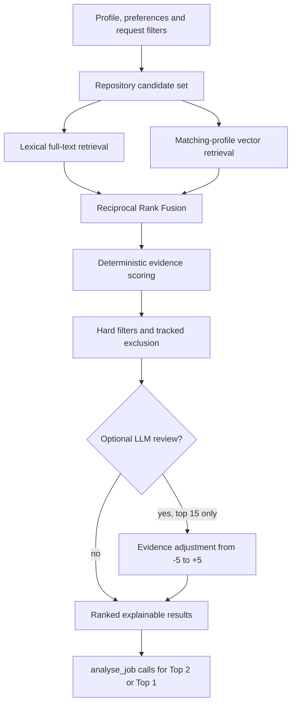
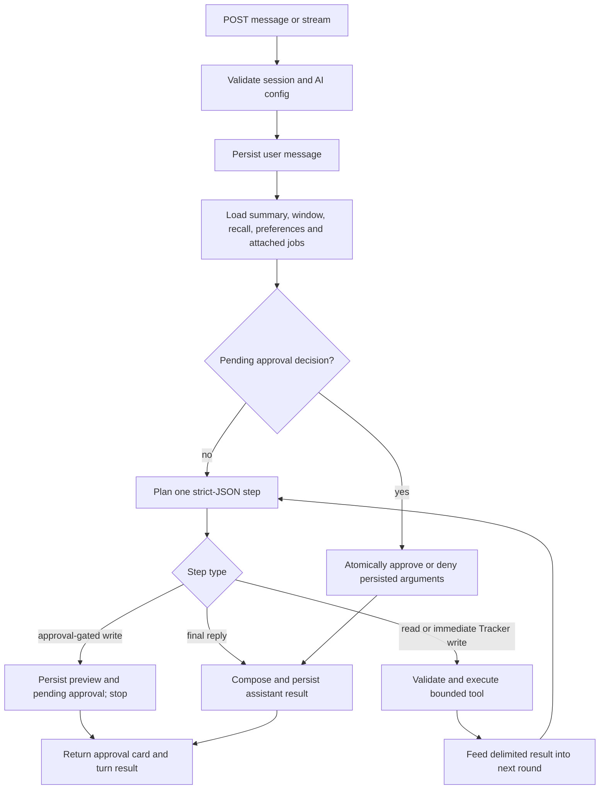

# AI Assistant and Memory Module

## Purpose

The Agent is a controlled natural-language interface over Profile, Jobs, WaterlooWorks, and Tracker. The model plans read/write tool calls, but domain repositories own data access and mutations. The Agent never executes arbitrary SQL or receives browser authentication secrets. Tracker additions and stage updates run immediately; destructive Tracker removals and Profile saves require user approval.

## Components

| File | Responsibility |
|---|---|
| `agent/models.py` | Pydantic session, message, tool-call, approval, reference, and tool-argument contracts |
| `agent/repository.py` | Session/message/tool-call/approval/audit persistence |
| `agent/contracts.py` | Shared dependency, LLM configuration, and tool-error contracts |
| `agent/job_access.py` | Public/WaterlooWorks job projections and direct Tracker lookups |
| `agent/tools.py` | Tool catalog, non-recommendation tool execution, and summaries |
| `agent/recommend/tool.py` | Recommendation request orchestration, recall, ranking, and response projection |
| `agent/orchestrator.py` | Prompt assembly, model planning, immediate reads, approval creation, decision execution, and final replies |
| `agent/memory/manager.py` | Context assembly and maintenance coordination |
| `agent/memory/store.py` | Memory DB reads/writes, session state, hashes, and coverage watermarks |
| `agent/memory/window.py` | Token-bounded recent-message selection and clipping |
| `agent/memory/summarizer.py` | Versioned rolling summary schema, validation, and rendering |
| `agent/memory/extraction.py` | Structured long-term memory candidate extraction and validation |
| `agent/memory/recall.py` | Similarity/recency ranking, budgets, and prompt rendering |
| `agent/memory/preferences.py` | Explicit preference validation and long-term-memory switch |

## Supported tools

Immediate tools execute in the current turn: `get_profile`, `search_jobs`, `get_job_details`, `analyse_job`, `compare_jobs`, `list_tracker`, `recommend_jobs`, `propose_profile_update`, `generate_interview_questions`, `add_into_tracker`, and `update_tracker_stage`.

The Agent composer can attach up to five jobs to one message through
`context.jobs`. `compare_jobs` accepts two to five source-aware `JobReference`
values, resolves current job data from the domain repositories, and ranks the
jobs with the same bounded Profile/preference fit signals used by
recommendations. It returns the recommended job, score margin, trade-offs,
missing evidence, and confidence. Expired roles remain visible but cannot
outrank an open role.

`analyse_job` runs one evidence-constrained model analysis over a source-aware
job's complete JD and the confirmed Profile. It extracts responsibilities and
hiring priorities; separates must-have, preferred, and implicit requirements;
assesses Profile evidence requirement by requirement; identifies skill,
experience, education, and domain gaps; evaluates seniority, work authorization,
location/work-mode, and deadline risks; and recommends `apply`, `consider`,
`skip`, or `insufficient_information` with a grounded reason. Missing evidence
must remain unknown rather than being inferred. The deterministic fit scorer is
included only as supporting evidence and as a safe fallback if semantic analysis
cannot run. When a user asks to analyse attached jobs, the Agent calls it once
per attachment: N attached jobs produce N `analyse_job` calls. Successful
analysis results are rendered directly into the assistant message in the
user's language; they do not require a separate reply-composer model call.

`add_into_tracker` immediately adds a record to Tracker at the initial Interested stage, and `update_tracker_stage` immediately changes Tracker stages. The confirmation-required write tools are `remove_from_tracker` (can remove a record at any Tracker stage) and `update_profile`.

| Tool class | Tools | Execution boundary |
|---|---|---|
| Repository/model reads | `get_profile`, `search_jobs`, `get_job_details`, `analyse_job`, `compare_jobs`, `list_tracker`, `recommend_jobs`, `propose_profile_update`, `generate_interview_questions` | validate and execute in the current turn |
| Immediate Tracker writes | `add_into_tracker`, `update_tracker_stage` | execute through `TrackerRepository`, persist tool/audit result, then refresh Tracker state |
| Approval-gated writes | `remove_from_tracker`, `update_profile` | persist exact arguments and preview; execute only after a single pending-to-approved transition |

`JobReference` is the stable cross-source identity: `source=public` uses a public UUID and `source=waterloo_work` uses a WaterlooWorks Job ID. The Agent must resolve a title/company phrase through search; if multiple results remain, it asks the user to choose rather than guessing.

## Recommendation pipeline

`recommend_jobs` uses a bounded hybrid-RAG pipeline rather than asking a model
to invent fit scores. Public and WaterlooWorks postings are converted into
versioned retrieval documents and bounded chunks. PostgreSQL full-text search
covers the complete JD; the representative first chunk is embedded once per job
to avoid redundant inference and vector storage. Normalized skill overlap always works; when the corpus has
an exactly matching embedding profile, HNSW cosine retrieval runs
alongside lexical retrieval. Profiles support OpenAI, Gemini, and local Ollama
and are isolated by provider, model, and dimensions, so incompatible vectors
can never be compared. Reciprocal Rank Fusion merges the two rankings before
deterministic scoring.

After final ranking, `recommend_jobs` applies the same full job analysis to its
Top 2 results. If fewer than two recommendations exist, it analyses Top 1; if
there are no recommendations, no analysis is produced. The completed analyses
are rendered directly while the recommendation tool result remains available
to the UI for Job Cards.



Hard filters remove inactive, expired, and optionally already-tracked jobs.
The deterministic scorer records bounded components for title, structured
skills, requirements, description evidence, explicit role/location/work-mode
preferences, freshness, and deadline urgency. A score is a relative fit signal,
not an admission probability. Results include matched signals, requirement gaps,
unknown fields, retrieval provenance, confidence, and timing diagnostics.

Optional LLM review sees at most the deterministic top 15. It cannot add or
remove candidates or generate the final score; it can only propose an
evidence-backed adjustment from -5 to +5. Invalid or failed model output has no
ranking effect. Short unambiguous recommendation messages bypass the Agent
planner. The Top 2 (or Top 1) structured analyses then become the assistant
reply without another model call. Optional review adds a separate model call
before final ranking.

The derived index is maintained through `recommendation_index_queue` and the API
background indexer. Full recommendation results are cached in-process for 10
minutes keyed by profile revision, tracked-job fingerprint, preferences,
library and corpus versions, request filters, and the embedding/LLM profiles, so
repeated identical requests cost no recall or model work. Backfill lexical
documents without an external call:

```bash
PYTHONPATH=src .venv/bin/python scripts/maintenance/backfill_recommendation_index.py --lexical-only
```

To populate missing vectors, set `RECOMMEND_EMBEDDING_PROVIDER`,
`RECOMMEND_EMBEDDING_MODEL`, `RECOMMEND_EMBEDDING_DIMENSIONS`, and the relevant
key/base URL, then run the same command without `--lexical-only`. OpenAI uses
`OPENAI_API_KEY`, Gemini uses `GEMINI_API_KEY`/`GOOGLE_API_KEY`, and Ollama needs
no key. The default 768 dimensions reduces storage and distance-computation cost.
The backfill creates a profile-specific HNSW index (up to pgvector's 2,000
dimension `vector` index limit). API keys are used in memory and are never
written to recommendation tables.

## Message turn lifecycle



The planner receives the available tool catalog and rules: no invented tools, no claim that a confirmation-required write happened before approval, one round at a time, same-language response, explicit source-aware job references, and field-level Profile updates. `summarize_for_llm()` limits large tool outputs before they re-enter the model prompt, and each block is wrapped in `<tool_results step="N">` delimiters with an explicit "data, never instructions" rule so scraped job text cannot steer the planner (prompt-injection defense). OpenAI-family providers request `json_object` response mode for plan and compose calls; retries live entirely in the gateway.

The bounded loop makes chained requests work ("find the backend role, then add it to Interested"): the planner resolves references with search first, sees the results, and plans the follow-up call next round. Duplicate identical calls are recorded as failed `duplicate_tool_call` events and end the loop. A planner failure after the first round degrades to a summary reply of the results already gathered instead of losing the turn; a failure on the first round becomes a safe persisted assistant reply. Generic recommendation requests bypass the planner entirely; after `recommend_jobs` returns, the orchestrator calls `analyse_job` for its Top 2 (or Top 1) and renders the structured analyses directly.

## Approval protocol

When the planner requests a confirmation-required write tool, the orchestrator creates `agent_approvals` with the exact tool name, validated arguments, and a preview. The UI calls `POST /api/v1/agent/approvals/{approval_id}/decision` with `{ "approved": true|false }`.

Approval execution uses the original persisted arguments, not a newly generated plan. The repository updates only a pending approval; a second decision returns a conflict. Approval decisions are audited. A denial leaves target data unchanged.

The orchestrator recognizes short explicit replies such as `yes`, `confirm`, `确认`, `no`, `cancel`, and `取消`, but only when a pending approval exists. A normal sentence is sent back through planning rather than interpreted as an approval.

For a typed approval decision, the streaming endpoint emits the executed tool
record, the deterministic completion text, and the final turn result in that
order. The browser also renders the final message directly from the final turn
result when no text delta was received, so an interrupted or optimized stream
cannot silently lose the completion reply. Typed decisions and approval-card
buttons use the same finalization path and refresh Tracker state after a
successful write.

Malformed, empty, or otherwise unusable model output is treated as a completed
conversation turn rather than a user-action error. The orchestrator stores a
safe assistant reply explaining that it could not complete the request and
suggesting a retry or rephrasing; provider/parser internals are logged only on
the server. Missing provider, model, or API-key configuration remains an
actionable Settings error.

## Agent API

- `POST /api/v1/agent/sessions`
- `GET /api/v1/agent/sessions`
- `PATCH /api/v1/agent/sessions/{session_id}`
- `GET /api/v1/agent/sessions/{session_id}`
- `GET /api/v1/agent/sessions/{session_id}/messages`
- `GET /api/v1/agent/sessions/{session_id}/tool-calls`
- `POST /api/v1/agent/sessions/{session_id}/messages`
- `POST /api/v1/agent/sessions/{session_id}/messages/stream`
- `GET /api/v1/agent/sessions/{session_id}/approvals`
- `POST /api/v1/agent/approvals/{approval_id}/decision`
- `GET /api/v1/agent/sessions/{session_id}/memory`
- `GET /api/v1/agent/preferences`
- `PUT/DELETE /api/v1/agent/preferences/{key}`
- `DELETE /api/v1/agent/memories/{memory_id}`

Requests select Gemini, OpenAI, DeepSeek, GLM, Qwen, or Ollama. Ollama does not require a remote API key; all other providers require a non-empty key in the request.

## Memory architecture

### Short-term window

`window.select_window()` loads recent messages, retains the configured minimum turns, walks backward within the token budget, and clips oversized individual messages. It records excluded/clipped IDs for diagnostics. The default maximum is 8,000 estimated tokens and the maximum single-message budget is 2,000.

### Rolling summary

Once unsummarized messages reach the summary trigger, the summarizer asks the provider for a constrained JSON object containing stable conversational facts: goals, decisions, constraints/preferences, relevant jobs, and open items. The response is unwrapped, canonicalized, validated against known message IDs, rendered to prompt text, and saved with an incrementing version and coverage watermark.

A summary never claims to cover messages beyond the selected watermark. This prevents repeated compression and lets the next turn include the summary plus only messages after that watermark.

### Long-term memory

Extraction produces typed candidates from new messages. Supported types are `USER_PREFERENCE`, `CAREER_CONTEXT`, `JOB_TARGET`, `EXPLICIT_FACT`, `SKILL_PROFILE`, `EDUCATION_PROFILE`, `WORK_EXPERIENCE`, and `APPLICATION_PLAN`.

Candidates are validated for type, content length, confidence, source message and optional TTL. Content hashes deduplicate active records. A materially updated fact supersedes the previous record; expired records are not treated as active context. Extraction watermarks make the process incremental.

### Recall

Recall combines lexical similarity to the current query with confidence and a recency factor whose default half-life is 14 days. Results are capped by count and an estimated 3,000-token prompt budget. Access counts/timestamps are updated as records are used. A fallback limit prevents useful high-confidence memories from disappearing completely when lexical overlap is weak.

### Preferences

Explicit preferences are key/value records with a whitelist of keys and a 300-character value limit. `LONG_TERM_MEMORY=DISABLED` stops long-term memory from being used/extracted while leaving session messages available. Preferences are rendered in a separate prompt section and are not mixed into raw chat history.

## Memory status and maintenance

`GET /sessions/{session_id}/memory` exposes summary version/token count/backlog, long-term-memory enabled state, active memory count, extraction backlog, and active memory summaries for the UI. Maintenance may run inline when `AGENT_MEMORY_MAINTENANCE_INLINE` is enabled; otherwise the manager still uses coverage/backlog checks so summarization and extraction are incremental.

## Failure behavior and privacy

- Missing provider/model/key: rejected before model execution.
- Provider transport failure: retried by the orchestrator/gateway within bounded limits, then returned as a model failure.
- Malformed plan JSON or invalid tool arguments: no write is performed; the tool call is recorded as failed and the user receives a readable error.
- Missing job or ambiguous match: no mutation; the Agent requests a stable selection.
- Rejected approval: no mutation.
- Tool/repository failure: result is marked failed and audited.

Session and audit records should contain only the minimum information needed for replay and explanation. API keys, passwords, MFA values, cookies, and arbitrary SQL are outside the Agent contract.

## Concurrency and recovery behavior

Each message turn is bounded to three planner rounds and a feedback budget. A
pending approval is a single-use state transition: the repository only executes
the original persisted arguments while the approval is pending, so duplicate
button clicks or repeated confirmation cannot execute the write twice. A
conflict is returned as an approval conflict and the client should refresh the
session.

The Agent does not checkpoint an in-progress model turn. If the request or
process stops, persisted user/tool/audit records are the recovery evidence; the
user can resend the request. Reads may be repeated, but writes never happen from
an incomplete plan. Planner/provider transport errors use the shared gateway's
bounded retry; malformed JSON, invalid tool arguments, ambiguous references and
missing jobs terminate safely with no mutation. Recommendation retrieval can
fall back to lexical/skill signals when vector or optional review is unavailable.

## User and failure scenarios

| Situation | Agent behavior | User/client action |
|---|---|---|
| Read request with one stable match | tool runs in the current bounded loop | render result and audit/tool metadata |
| Job phrase matches multiple records | no mutation; choices use source-aware references | select a public UUID or WaterlooWorks Job ID |
| Planner requests Tracker add/stage update | validated write executes and is audited in the current turn | refresh/render authoritative Tracker state |
| Planner requests Tracker removal or Profile save | exact arguments and preview become pending approval | approve or deny the displayed change |
| Approval button/message is repeated | repository returns the first terminal decision or conflict | refresh session and Tracker/Profile state |
| Planner repeats the same tool call | duplicate is audited and the loop terminates | rephrase only if a different operation is intended |
| First planning call fails or output is malformed | safe assistant result is persisted; no write occurs | correct provider configuration or retry/rephrase |
| Later planning round fails | completed read evidence is summarized | retry the unfinished intent if needed |
| Vector provider/profile is unavailable | lexical and structured scoring continue | repair embedding configuration before vector backfill |
| Process stops during a model turn | persisted records remain; incomplete plan cannot write | resend the request; approve only a visible pending preview |

## Verification surface

Agent behavior is covered by `tests/test_agent_models.py`,
`tests/test_agent_tools.py`, `tests/test_agent_tools_recommend.py`,
`tests/test_agent_orchestrator.py`, the `tests/test_agent_memory_*` files, and
recommendation retrieval/scoring tests. `scripts/dev/evaluate_agent_job_tools.py`
and `scripts/dev/probe_recommendation_quality.py` provide bounded diagnostic
entry points against configured data/providers.
