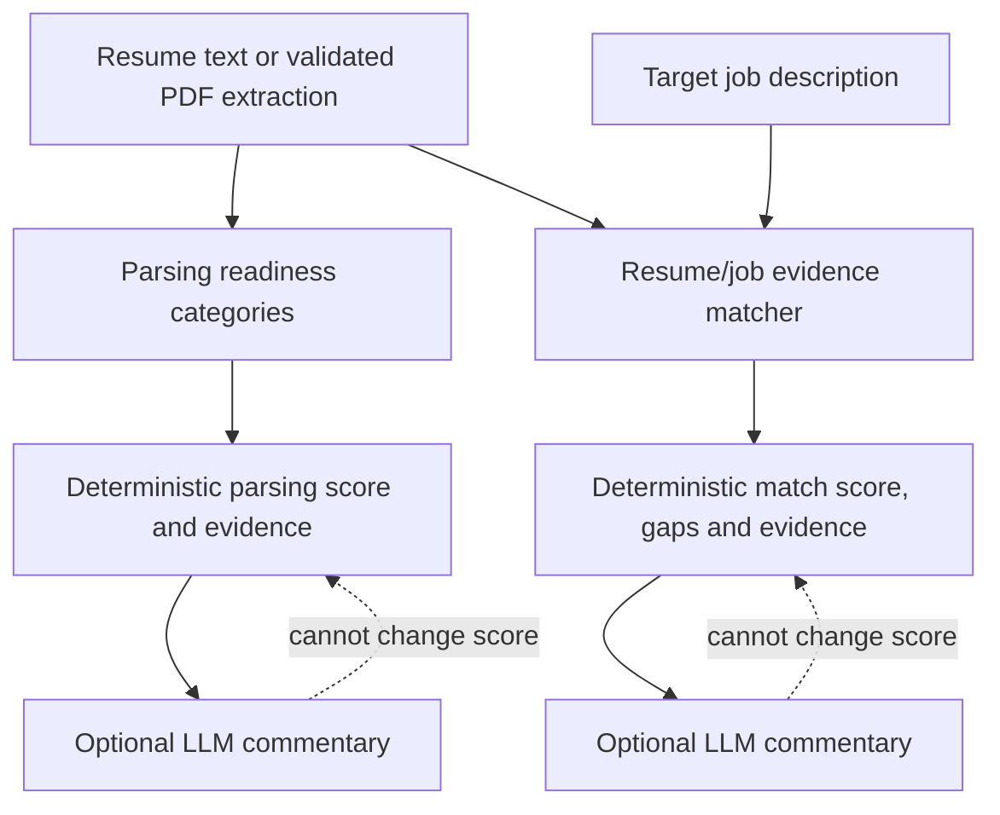

# ATS-Style Resume Diagnostics

The UI exposes two independent sections—Resume ATS Score and ATS Match—backed
by separate deterministic API routes. It does not claim to reproduce Workday,
Greenhouse, Taleo, or an employer's
ranking model, and neither score is an admission probability.

## Diagnostic separation

Parsing readiness and job fit are independent contracts. A clean PDF cannot
inflate candidate/job relevance, and a relevant resume cannot hide extraction,
section, contact, entry-structure, reading-order, or date-consistency problems.
Both diagnostics expose category-level evidence instead of presenting an
employer-specific ranking claim.

## Resume Parsing Readiness

The Resume ATS Score section calls `POST /api/v1/ats/score` for pasted text.
PDF uploads use the shared `POST /api/v1/resumes/extract-pdf` boundary so the
score can include page-layout evidence.

After the deterministic score is available, the section calls
`POST /api/v1/ats/score/commentary` with that diagnostic and the resume text.
The selected AI provider returns a short assessment, supported strengths, and
prioritized improvements. This qualitative layer cannot alter or replace the
numeric score. If AI generation is unavailable, the score remains visible and
the section shows an inline feedback message.

`score_parsing_readiness` is a pure function. The PDF endpoint provides page
text so page-level extraction and reading-order heuristics can be assessed.
Pasted text runs in `text_only` mode and marks PDF reading order unavailable.

| Category | Maximum |
| --- | ---: |
| Text extraction | 30 |
| Standard section recognition | 25 |
| Contact parsing | 10 |
| Entry structure | 15 |
| PDF reading order | 10 |
| Date consistency | 10 |

Unavailable categories are excluded from the denominator rather than silently
awarding or deducting points. Every category includes evidence and a status.

## Resume-Job Match

The ATS Match section calls `POST /api/v1/ats/match` with resume text and one
target job description.

`score_job_match` extracts source-backed signals with deterministic rules. A
skill is only scored when an alias from the versioned skill taxonomy appears
in the job description, and every match or gap retains the source line.

| Category | Maximum when applicable |
| --- | ---: |
| Required skills | 35 |
| Preferred skills | 15 |
| Explicit experience duration | 20 |
| Explicit education requirement | 10 |
| Role-family alignment | 10 |
| Normalized term relevance | 10 |

Requirements not stated in the job description are `unavailable` and excluded
from the denominator. Eligibility language such as sponsorship, citizenship,
clearance, and driver's-license requirements is surfaced separately and does
not disappear into the total score.

If the description contains no explicit skill, education, or experience
requirement, the module returns **Insufficient evidence** instead of deriving a
precise-looking number from a title or generic wording alone.

The selected AI provider, model, and API key do not affect either score. LLM
output is never accepted as a score.

## Invariants

- The same inputs produce the same score.
- Adding genuine matching evidence cannot reduce a skill-coverage component.
- An unstated education or years requirement cannot create a penalty.
- Text-only input cannot claim PDF-layout analysis.
- Every scored signal has source evidence.
- Prompt-like text inside a resume or job description cannot override scoring.

## Input scenarios

| Input | Diagnostic behavior | User interpretation |
|---|---|---|
| Valid PDF with page text | all applicable parsing categories are scored | review score plus per-category evidence |
| Pasted text | PDF reading-order category is unavailable and excluded | do not compare the raw denominator to PDF mode |
| Job description states explicit skills/education/experience | applicable categories receive source-line evidence | use matches and gaps as preparation signals |
| Requirement category is unstated | category is unavailable and excluded | no penalty is inferred |
| Job description lacks enough explicit evidence | `Insufficient evidence` instead of a precise score | use a fuller JD before comparing fit |
| Commentary provider fails | deterministic score and evidence remain | retry commentary only if qualitative advice is desired |

## Verification surface

`tests/test_ats.py` covers parsing-readiness and job-match formulas, evidence,
unavailable categories, aliases, and invariants. `tests/test_ats_commentary.py`
checks that commentary is grounded in and cannot replace the deterministic
diagnostic. Calibration cases live in `tests/fixtures/ats_calibration_cases.json`.
