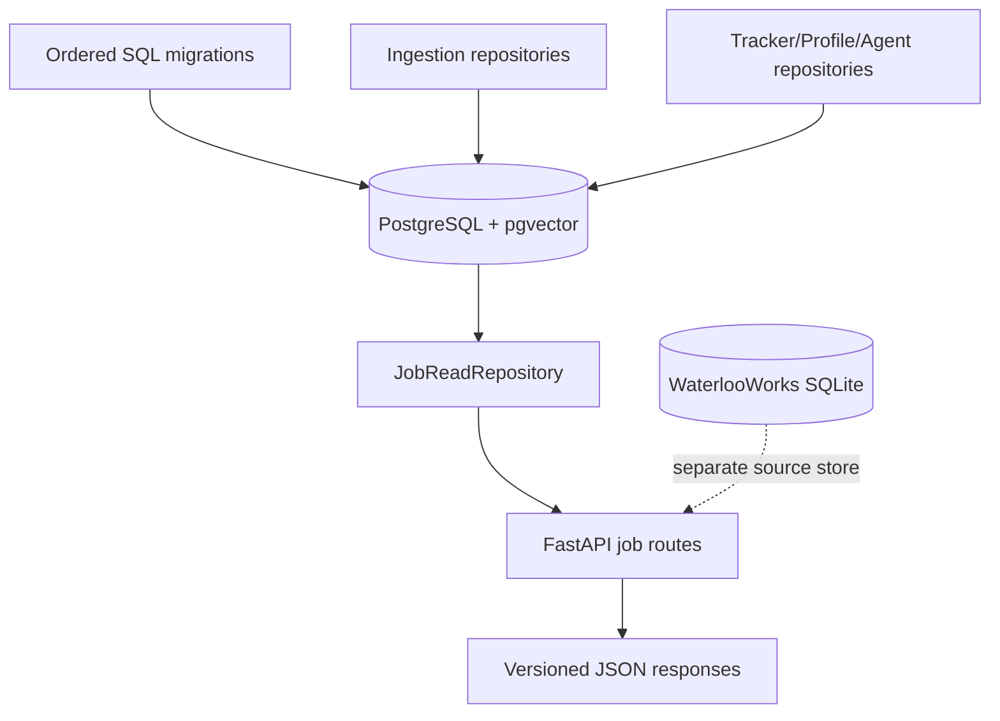
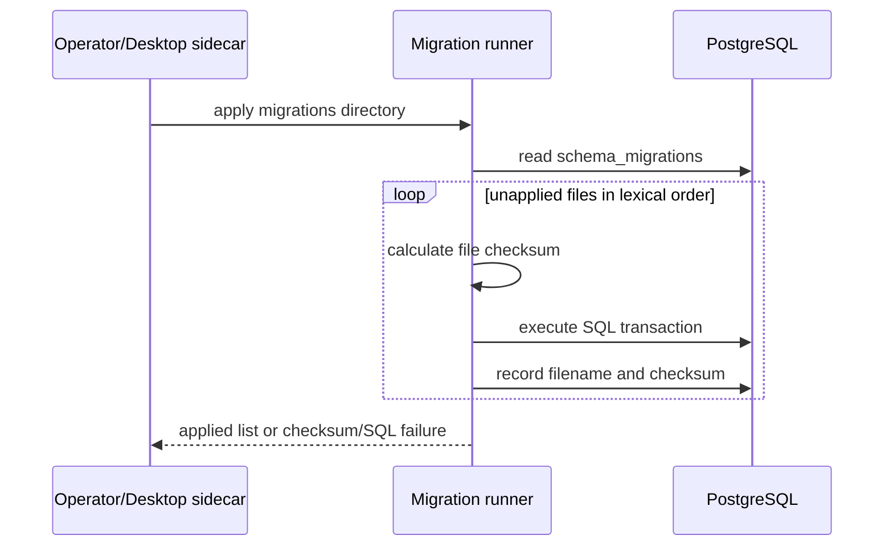
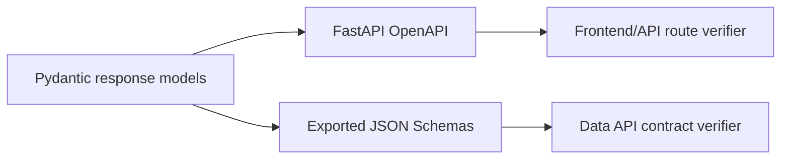

# Database and Data API Module

## Persistence topology

The application uses PostgreSQL for public jobs and all cross-feature application data. WaterlooWorks is intentionally separate and is documented in [the WaterlooWorks module](waterlooworks.md).



`src/wecanfindintern/db/pool.py` creates the async psycopg pool. `Settings`
controls minimum/maximum pool size and statement timeout. `read_repository.py`
is the read-facing job query layer; `db/repositories/` contains ingestion,
collection-cache, salary, and recruiting-term repositories.

## Migration sequence

`scripts/maintenance/migrate.py` applies the numbered SQL files in order and
records applied versions. The resulting schema covers jobs/sources/raw
snapshots/ingestion runs, classification and location hierarchy,
salary/recruiting-term enrichment, Tracker, Profile, interview sessions,
recommendation retrieval, LLM cache, Agent persistence, and Agent memory.
Campaign definitions are file-backed in `config/collection_plans.json`, and
campaign recovery uses a safe idempotent rerun from source.

Each migration is designed to be rerunnable through `IF EXISTS`, `IF NOT EXISTS`, guarded constraints, or controlled alteration checks. The migration directory README describes the operational command and ordering.



## Core job tables

### `ingestion_runs`

Represents one single-query ingest or full campaign. It stores source/query
metadata, sweep number/mode for catalog campaigns, timestamps, status, and
counters for created, merged, updated, unchanged, failed, and enriched records.

### `jobs`

Stores the current canonical job. It uses an internal BIGINT primary key for
database joins and a public UUID for API references. It contains
title/company/location/work mode, opportunity and schedule classification,
categories/tags, description, date fields, salary fields, salary-enrichment
input hash/status/check time/model, lifecycle status, and dedupe block. Active
partial indexes support the hot feed.

### `job_sources`

Stores source-specific identity and links for each canonical job. Unique indexes
enforce source fingerprint idempotency and the source/source-job-id relationship.
`details_fetched_at` distinguishes a successful LinkedIn detail fetch from a
list-card observation and drives detail-cache freshness. A detail response can
show every source link without joining raw payloads into the list query.

### `raw_job_snapshots`

Stores source payloads against an ingestion run and source record. The table is partitioned by scrape time and has time-oriented indexes. A new snapshot is written only when the payload hash changes; this preserves auditability without copying identical payloads on every campaign.

### Dedupe/status tables

`dedupe_candidates` records indexed candidate pairs and comparison state. `dedupe_decisions` records scores, rule hits, algorithm version, and resulting canonical job. `job_status_history` records active/possibly-closed/closed/expired changes.

## Application feature tables

- Profile: `user_profiles`, repeated profile child tables, `resume_documents`, `profile_imports`.
- Tracker: `application_tracker`, `application_tracker_events`.
- Agent: `agent_sessions`, `agent_messages`, `agent_tool_calls`, `agent_approvals`, `agent_audit_log`.
- Memory: `agent_conversation_summaries`, `agent_memories`, `agent_user_preferences`, and memory coverage/type columns.
- Interview: `interview_sessions`, `interview_answers`.
- Recommendation: `recommendation_documents`, `recommendation_chunks`,
  `recommendation_chunk_embeddings`, `recommendation_corpus_state`, and
  `recommendation_index_queue`.
- Shared LLM cache: `llm_cache`.

Foreign keys cascade child records with their owning entity. Public UUIDs are used by API models; internal numeric IDs remain database-only.

## Public job API

### `GET /api/v1/jobs`

Filters include `query`, `location`, `country`, `region`, `city`, `company`,
`work_mode`, `employment_type`, `opportunity_type`, `schedule_type`, `category`,
`subcategory`, `skill`, `season`, `recruiting_year`, `recruiting_term`,
`has_recruiting_term`, `source`, `posted_after`, annual/hourly salary bounds,
`has_salary`, and `currency`. `limit` is 1–100; the default is 30.

All filter values are passed into `JobListFilters`, where values are validated and normalized before SQL is built. Invalid dates, salary expressions, cursor values, and incompatible filter values are returned as 422 by the route.

### Cursor pagination

The repository orders active jobs by `published_sort_at` and internal `id`. `encode_cursor()` stores those two values in an opaque base64 URL-safe value; `decode_cursor()` validates and returns the pair. The next page uses a keyset predicate rather than a deep OFFSET. The response is:

```json
{
  "schema_version": "job-page.v3",
  "items": [],
  "total_count": 0,
  "last_updated_at": null,
  "next_cursor": null,
  "has_more": false
}
```

`total_count` is computed against the complete filtered active set.
`last_updated_at` is the greatest available ingestion/job visibility timestamp.
The UI uses both values for result and freshness indicators. Details and source
links are loaded separately.

The public route orders by `(published_sort_at DESC, id DESC)`, including when a
text query is present. The repository also supports a relevance-ranked mode for
bounded internal callers such as Agent search; its cursor adds the computed
text-search rank before timestamp and ID.

### `GET /api/v1/jobs/{job_id}`

The UUID path parameter is parsed before repository access. Missing jobs produce 404. The detail contract includes canonical fields and all source links but excludes raw provider payloads.

### `GET /api/v1/jobs/facets`

Facets are generated from active jobs and return counts for opportunities, schedules, categories, work modes, skills, locations, and companies. The front end uses them to build filter controls; facet values are structured machine codes plus display labels where available.

### `GET /api/v1/jobs/geo-distribution`

Returns active-job counts per Canadian province/territory and US state, with
country and overall totals for `web/modules/heatmap.js`.

## Query and index design

- Active-feed partial indexes cover common location, company, work mode, employment, category, schedule, salary, recruiting-term, and date filters.
- The generated full-text search document covers title, company, location, and
  normalized skill tags while excluding long descriptions.
- Raw snapshot BRIN/time indexes support audit and retention operations.
- Lists compute their filtered count separately and avoid source JSON
  aggregation; details aggregate source links on demand.
- Connection pooling and statement timeouts prevent one slow query from consuming unbounded resources.

## Ingestion transaction behavior

The jobs repository uses source fingerprint and dedupe-block advisory locks inside the transaction. This prevents two concurrent writers from creating the same source or racing on the same cross-source block while allowing unrelated blocks to proceed concurrently.

For each batch, payload hashes are evaluated first. Existing source fingerprints
with the same payload hash are refreshed in one set-based SQL statement and skip
per-row dedupe. That update advances source/job visibility, reactivates the
canonical job, clears `closed_at`, and advances a supplied LinkedIn detail
timestamp. It adds no duplicate raw snapshot. Changed/new payloads follow the
locked per-record path, update source/current canonical values, and write a new
snapshot tied to the ingestion run. Dedupe decisions remain auditable.

### Transaction, concurrency, and recovery contract

An ingestion campaign is not one giant transaction. Canonical jobs are written
in `batch_size` batches, and each repository mutation owns a short transaction.
If a batch fails, that batch rolls back; already committed batches and their run
metadata are retained. Re-running the campaign is the recovery mechanism because
`source_fingerprint`, source uniqueness, dedupe locks, and payload hashes make
the write path idempotent.

Advisory locks are acquired inside the transaction and released automatically at
commit/rollback. A fingerprint lock prevents the same source row from racing; a
dedupe-block lock serializes only candidates that could actually match. Pool
limits and statement timeout bound resource usage, but do not replace query
optimization or deployment-level worker limits.

The API returns a readable error for a transaction or pool failure. It does not
silently convert a failed write to success, and it does not delete the complete
job corpus as a rollback. Point-in-time recovery requires a targeted
maintenance operation or a verified PostgreSQL backup restore.

### Read/write behavior by outcome

| Situation | Database behavior | API/operation behavior |
|---|---|---|
| repeated source record | unique lookup and update/unchanged outcome | no duplicate canonical row |
| repeated identical batch records | set-based visibility/detail-freshness update | no candidate scan or raw snapshot insertion |
| changed source payload | current source/canonical fields update and new snapshot by hash | detail remains source-linked |
| duplicate across sources | audited merge and new source edge | one public job with multiple links |
| invalid cursor/filter | no SQL mutation | 422 |
| missing public UUID | no mutation | 404 |
| timeout/deadlock/constraint error | current transaction rolls back | readable error; retry after diagnosis |
| raw snapshot partition absent | safe/default partition may receive row | create future partitions and monitor default |

## Contract files and verification



The public contracts are versioned as `job.v3`, `job-detail.v4`, `job-page.v3`, and `job-facets.v2` in `schemas/`. Detail responses expose verbatim adapter values as `source_skills` and normalized values as `skill_tags`. `scripts/dev/export_schemas.py` regenerates schema artifacts from Pydantic models. `scripts/dev/verify_data_api_contract.py` checks the data response contract; `scripts/dev/verify_frontend_api_contract.py` checks that front-end API references resolve to registered FastAPI routes.
