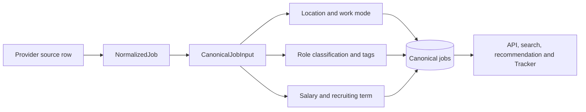
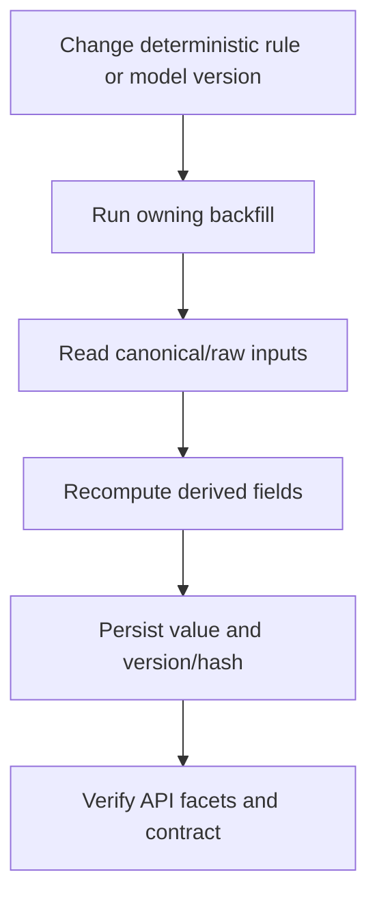

# Domain and Data Normalization Module

## Purpose

The domain layer converts source records into deterministic business values used by storage, search, filtering, display, recommendations, and application support. It is independent from JobSpy internals and PostgreSQL row shapes.



## Canonical contract

`src/wecanfindintern/domain/jobs.py` defines the principal canonical contract,
while `src/wecanfindintern/domain/normalized_job.py` defines the provider-neutral
ingestion boundary:

- `CompanyProfile`: display name, normalized name, industry, URLs, logo, addresses, employee/revenue labels, and description;
- `IngestionSource`: source identity, source/direct URLs, canonical URLs, fingerprint, and source payload;
- `DedupeKeys`: normalized company/title/location/block keys plus description/direct URL hashes;
- `SalaryRange`: original interval/value/currency/source plus annualized values;
- `CanonicalJobInput`: title, company, location, work mode, employment types, opportunity/schedule/category fields, tags, dates, description, salary, source data, dedupe keys, and first-seen time.

`canonical_job_from_normalized()` is the shared construction boundary used by
JobSpy and WaterlooWorks adapters. It uses UTC for timestamps, uses the posted
date at midnight UTC for stable ordering when present, and uses the scrape time
when the provider omitted a date.

## Text normalization

`domain/normalization.py` provides shared primitives for whitespace and Unicode normalization, title and company keys, employment types, description whitespace, Decimal conversion, salary annualization, UTC timestamps, and SHA-256 text hashing.

Normalized keys are never used as display text. Source text stays available through display fields and the raw snapshot boundary.

## Location normalization

`domain/location.py` parses provider location text into `Location`:

```json
{
  "raw": "Toronto, ON, Canada",
  "city": "Toronto",
  "region_code": "ON",
  "region_name": "Ontario",
  "region_type": "province",
  "country_code": "CA",
  "country_name": "Canada",
  "normalized": "toronto|on|ca"
}
```

The parser supports country aliases, Canadian provinces/territories, US states and DC, common misspellings, country-only values, and remote/worldwide values. Canada and the United States receive their structured region types; other recognized countries retain country identity while region parsing stays conservative.

If parsing is incomplete, `raw` remains available and the untrusted portion is not fabricated into a country, state, or city. This lets the API show the provider value while keeping facets deterministic.

## Work mode

`WorkMode` is `onsite`, `hybrid`, `remote`, or `unknown`. The canonical converter combines the provider remote flag, work-from-home text, location text, and description signals. A missing remote marker is not treated as proof of onsite work; it remains unknown unless the source or text gives a reliable signal.

## Classification

`domain/classification.py` contains the deterministic classifier and `CLASSIFICATION_VERSION=4`. It emits:

- `OpportunityType`: internship, co-op, new-grad, apprenticeship, regular, contract, temporary, seasonal, unknown;
- `ScheduleType`: full-time, part-time, flexible, unknown;
- one `JobCategory` such as software engineering, data/AI, cybersecurity, cloud/DevOps, QA, product, IT, hardware, research, business, engineering, legal, customer service, supply chain, administrative, or other;
- job subcategories, skill tags, requirement tags, display tags, and the algorithm version.

Classification is deterministic, versioned, and backfillable. Rules use normalized title and supporting text, with category keyword groups ordered to resolve more specific categories before broad software or engineering terms. A title’s role determines the main category; JD technologies become skills and do not override the role category.

Opportunity type and schedule are independent dimensions. A `software developer co-op` can therefore be `opportunity_type=co_op` and `primary_schedule_type=full_time` at the same time. Multiple schedule matches are retained in `schedule_types`; the primary value is used for concise display/filtering.

## Salary normalization

`domain/salary.py` handles structured and description-derived compensation. It recognizes currency symbols/codes, ranges, single values, and hourly/daily/weekly/monthly/yearly intervals. Decimal values are retained as Decimal until serialization.

Validated provider-structured salary is persisted with the canonical job during the initial ingest, even when the posting has no JD. Values reported as description-derived by a provider are not treated as structured data. Salary extraction from JD text runs only after deduplication: deterministic regex first, then the bounded DeepSeek fallback for remaining candidates.

Annualization uses hourly × 2,080, daily × 260, weekly × 52, monthly × 12, and yearly/annual × 1. The salary interval integrity migration enforces interval-specific amount ranges and annual minimum/maximum ordering. Unknown or invalid compensation is kept absent instead of being converted to a misleading zero.

## Recruiting term normalization

`domain/recruiting_term.py` extracts a normalized season and year from titles and descriptions. The supported seasons are Winter, Spring, Summer, and Fall. It preserves the normalized `recruiting_term` string together with separate `recruiting_season` and `recruiting_year` fields for filtering.

Regex extraction is attempted first. `ingestion/recruiting_term_llm.py` provides a constrained DeepSeek JSON fallback when the text is ambiguous. `ingestion/recruiting_term_enrichment.py` persists a content hash and generated result, so an unchanged title/JD pair is not sent to the model repeatedly.

## Deduplication inputs

`deduplication.py` does not compare every job with every other job. It generates indexed candidates using direct URL hash, company/location block, and a ±60-day publication window, capped at 25 candidates. Candidate comparison considers direct URL, company, title, location/work mode, date distance, and 5-token description shingles.

The result is a scored decision with matched rules and algorithm version. A confirmed match attaches another source to the existing canonical job; an uncertain/non-match keeps a separate job. Source-level idempotency and cross-source identity are distinct decisions.

## Recalculation rules

Derived values must be recomputable from stored canonical/raw data. When classification rules change, `scripts/maintenance/backfill_job_classification.py` recalculates current jobs and stores the new classification version. Salary and recruiting-term backfills use their own repositories and content-hash caches. A recalculation must not mutate source URLs, source IDs, source fingerprints, or raw snapshots.



## Input and recalculation scenarios

| Input/state | Normalized result | Operational rule |
|---|---|---|
| Complete structured source value | typed canonical value | preserve source text and normalized value |
| Unknown or ambiguous location/work mode | raw text plus unset/`unknown` structured fields | do not invent country, city, mode, or coordinates |
| Implausible salary | absent derived salary | retain raw source evidence; never serialize zero as a substitute |
| Multiple role signals | deterministic ordered category plus supporting tags | title controls primary role; JD tools remain skills |
| Classification algorithm change | recomputed fields with new `classification_version` | use the classification backfill; keep source identity unchanged |
| Title/JD changes after enrichment | new content hash and recalculation eligibility | caches reuse only matching inputs |

## Verification surface

Domain behavior is covered by `tests/test_location.py`,
`tests/test_job_classification.py`, `tests/test_salary_enrichment.py`, and
`tests/test_recruiting_term.py`. Public vocabulary is cross-checked against
[Job Data Taxonomy](../JOB_DATA_TAXONOMY.md) and the schemas in `schemas/`.
