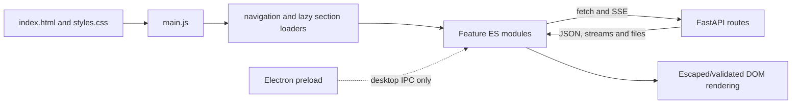

# Frontend Module

## Architecture

The web UI is a static HTML/CSS/ES-module application served by FastAPI from `web/`. There is no build step in the repository. `index.html` provides the DOM and feature sections; `styles.css` preserves the feature-level visual system; `app-shell.css` defines the desktop shell, bounded workspaces, and narrow-screen overlays; `modules/main.js` wires feature initialization and shared navigation.

The primary navigation is grouped by user task: Discover contains Public Jobs and a separate WaterlooWorks workspace, Manage contains Applications, Career Tools exposes Resume ATS Score, Job Match, Cover Letter, and Interview Coach, and Workspace contains Assistant and Profile. Settings remains persistently available at the bottom of the sidebar. Opportunity Map is a List/Map view inside Public Jobs rather than a separate global destination.

The browser calls the versioned REST API directly with `fetch`. API route order is defined before the static mount so `/api/...` paths are not shadowed by the HTML fallback.

## Module map

| Module | Main responsibility |
|---|---|
| `main.js` | Application startup and global interactions |
| `navigation.js` | Sidebar/tab activation, URL hashes, Public Jobs List/Map state, and mobile drawer behavior |
| `helpers.js` | HTML escaping, Markdown rendering, labels, dates, salary formatting, timeout fetch, drop zones |
| `pagination.js` | IntersectionObserver-based infinite scrolling within a selected scroll root |
| `bookmarks.js` | Shared public/WaterlooWorks bookmark state and mutations |
| `job-context.js` | Stable open-job context shared with career tools and Agent |
| `resume-source.js` | Shared current Profile/resume projection for career tools |
| `sse.js` | Shared Server-Sent Events parsing and completion handling |
| `tracker-contract.js` | Backend-owned Tracker stage/source vocabulary |
| `heatmap.js` | Job geo-distribution map rendering |
| `jobs.js` | Public job search/list/detail and facets |
| `waterlooworks.js` | Local source status, collection, list, and detail |
| `tracker.js` | Application list, bookmarks, drawer, events, bulk operations, CSV, custom jobs |
| `profile.js` | Profile editor, resume upload/import draft, history, save/delete |
| `ats-shared.js` | Shared resume upload, ATS request, and score-breakdown rendering |
| `ats-score.js` | Standalone resume ATS parsing score plus grounded AI commentary |
| `ats-match.js` | Standalone resume-to-job match section |
| `cover-letter.js` | Profile/resume input, generation, review, DOCX/PDF export |
| `interview.js` | Questions, TTS, camera/recording, answer analysis |
| `agent.js` | Sessions, chat, tools, approval, memory, preferences |
| `settings.js` | Provider/model/Ollama settings, browser storage, and desktop secure-key bridge |

## Public job flow

`jobs.js` loads `/api/v1/jobs/facets`, maps structured facet codes into filter
options, reads search/filter controls, and builds repeated query parameters.
Any new filter resets the keyset cursor. `loadJobs({append})` shows
loading/error state, requests a page, appends or replaces cards, renders
`total_count` and `last_updated_at`, saves `next_cursor`, and stops infinite
scrolling when `has_more=false`.

Opening a card requests `/api/v1/jobs/{uuid}` and renders canonical title/company/location, salary, tags, description, source links, and Tracker action in an adjacent detail pane. Filters use a temporary sheet instead of consuming a permanent column. Infinite scroll is scoped to the results pane; Opportunity Map is selected with the local List/Map switch while Public Jobs remains the active global destination.

## WaterlooWorks flow

`waterlooworks.js` polls `/status` while connecting or synchronizing and uses one
sync dialog to select job postings, submitted applications, or both. When both
are selected, posting collection finishes first and application synchronization
is queued next. Board source, work mode, and opportunity type are multi-select
filters; company, skill, category, location hierarchy, and posted date are also
available. New filter requests abort or supersede older list requests, reset the
cursor, and scroll the results root to its start.

On desktop, sync controls, the posting list, and posting detail are sibling
panes; on narrow screens the detail pane becomes an overlay. Details are fetched
separately. A local Job ID remains distinguishable from a public UUID in Tracker
and Agent actions, and WaterlooWorks postings remain outside the Public Jobs
list.

## Tracker flow

The Tracker module keeps filters and numbered paging in the URL, fetches
applications and both bookmark lists in parallel, and updates cards/buttons
after mutations. The desktop layout presents the application list and selected
application as sibling panes; the drawer becomes a narrow-screen detail overlay.
Bulk actions operate on selected application IDs; custom-job creation calls the
full tracker create endpoint.

## Profile and generated-content flow

Profile forms are generated from section configuration. Repeated records can be added/removed in local state and then saved. Resume upload shows an import draft without overwriting saved data. Cover-letter and interview tools use the selected provider; ATS parsing readiness and job matching are deterministic and do not use provider settings.

## Agent flow

`agent.js` creates or restores sessions, loads messages and pending approvals,
posts the current message with the selected provider/model/key, renders
assistant text and typed job/tool results, and shows approval buttons for
pending writes. The composer can attach up to five source-aware jobs selected
from Public Jobs or WaterlooWorks. Attachments and the currently open job are
sent as request context, allowing analysis, comparison, and Tracker operations
to resolve stable identities. Session rename/delete, preferences, memory status,
and memory deletion use their dedicated endpoints.

## Rendering and safety

`escapeHtml()` is used for ordinary dynamic text. Markdown rendering handles job descriptions and generated text through the shared helper rather than injecting raw provider output. Buttons and links are created from validated IDs/URLs where possible. API errors are converted into plain user-facing notices.

The API contract verifier scans front-end fetch/link references and checks that corresponding FastAPI routes exist. Node syntax checks run over every ES module. These checks catch path drift even though the UI has no bundler.

## Browser state

AI settings are stored locally because the service receives them per request. In the Electron desktop build, API keys are encrypted through the operating-system secure store and only non-secret preferences remain in renderer local storage; the browser development build retains its local-storage fallback. Tracker filter state is reflected in the URL for reload/share behavior. Server-backed application data—profile, jobs, resumes, Tracker, Agent conversations, approvals, memory, and preferences—comes from PostgreSQL/SQLite API calls rather than being treated as browser-only state.

## Loading, failure, and retry behavior

The UI distinguishes initial loading, empty success, partial/board progress, and
request failure. Filter changes reset keyset cursors; failed list/detail calls do
not advance the saved cursor. WaterlooWorks status is polled while a background
task is active, and the displayed board counters remain usable when one board
fails. Agent approval buttons are disabled/updated from the returned approval
state so a browser retry cannot assume that a write occurred.

Desktop sections use a fixed application shell. Long content scrolls within sibling result, detail, editor, or chat panes instead of creating nested page scroll. At `900px` and below, the sidebar becomes a drawer, master/detail panes become list plus full-screen detail, and form/result tools return to a natural single-column document flow.

The frontend does not implement an independent automatic retry loop for every
HTTP request. It displays the server's readable error and lets the user retry;
server-side collection, provider, and repository layers own bounded retries and
idempotency. In desktop mode, the preload bridge is the only path for secrets,
backup, tray, and background-collection commands.

## UI state scenarios

| Situation | Frontend state transition |
|---|---|
| Initial section visit | lazy-load module, show loading state, then content/empty/error |
| Filter changes | clear cursor/page continuation before requesting fresh results |
| List/detail request fails | preserve prior usable view and do not advance pagination |
| SSE sends progress then completion | render bounded progress and reconcile with final result event |
| SSE ends after a persisted operation | reload authoritative session/Tracker/Profile state |
| WaterlooWorks board is skipped | keep the run successful when all accessible work completes and retain the board's skipped state |
| WaterlooWorks board is partial | keep successful board counters/items and show failed board evidence |
| Approval is decided | disable/update approval UI and refresh affected domain state |
| Desktop secret/backup action | call the restricted preload method; renderer never reads filesystem/Node APIs |

## Verification surface

`scripts/dev/verify_frontend_api_contract.py` compares frontend route references
with FastAPI routes. `make frontend-check` runs Node syntax validation for every
`web/modules/*.js` file and checks the navigation/layout contract in
`tests/frontend/navigation.test.mjs`. Route/service tests validate the response
contracts the modules consume.
