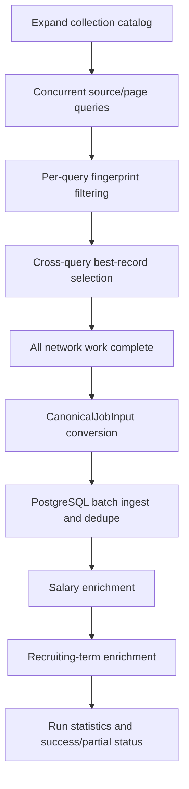

# Job Ingestion Module

## Purpose

The ingestion module turns source-specific JobSpy results into stable internal records, stores the raw source material, and coordinates multi-source collection. Its public boundary is `NormalizedJob`; downstream business code never depends directly on a JobSpy DataFrame.

## Components

| Component | File | Responsibility |
|---|---|---|
| Query contract | `src/wecanfindintern/ingestion/jobspy_adapter.py` | Validates the arguments passed to JobSpy |
| JobSpy boundary | `src/wecanfindintern/ingestion/jobspy_adapter.py` | Calls vendored JobSpy and normalizes rows |
| Query location | `src/wecanfindintern/ingestion/location_query.py` | Applies source-specific location/country query values |
| Collection catalog | `src/wecanfindintern/ingestion/collection_catalog.py` | Expands JSON plans into executable definitions |
| Campaign runner | `scripts/collection/run_collection_campaign.py` | Runs every query, retries failures, then persists and enriches |
| Single-query runner | `scripts/collection/ingest_jobspy_to_db.py` | Runs one JobSpy query and writes a batch |
| Developer CLI | `src/wecanfindintern/ingestion/jobspy_cli.py` | Shared CLI parsing and query defaults |

The vendored upstream implementation is in `vendor/JobSpy`. The project pins
and audits the local source rather than importing an unconstrained package at
runtime.

## Input contract

`JobSpyQuery` contains the source list, search term, optional Google search term, location, distance, remote/job-type/easy-apply filters, result count, Indeed country, proxies, certificate path, description format, LinkedIn description flag, offset, age filter, annual salary flag, verbosity, and user agent.

The source restrictions enforced by JobSpy remain relevant at the caller boundary. In particular, Indeed does not allow `hours_old`, `job_type + is_remote`, and `easy_apply` to be combined as arbitrary independent filters; LinkedIn does not allow `hours_old` and `easy_apply` together. The campaign uses `source_overrides` when a source requires a different query shape.

## Processing a query

`scrape_and_normalize()` performs the following steps:

1. Calls JobSpy `scrape_jobs()` with the validated query.
2. Copies the DataFrame and applies `stabilize_jobspy_frame()`.
3. Adds missing columns from the project’s documented JobSpy column set, including for a zero-row response.
4. Restricts the DataFrame to that stable column order.
5. Converts rows to JSON-safe dictionaries.
6. Converts each row into `NormalizedJob`.

JobSpy returns a pandas DataFrame. A no-result response can have zero rows and zero columns; stabilization converts it into zero rows with the full stable column contract. Flattened source fields such as `job_type`, `emails`, and source skill lists remain source-bound strings until the project normalizer splits and cleans them.

`NormalizedJob` preserves both normalized values and `raw`. The normalized fields include source fingerprint, source job id, source/direct URLs, title, company, location text, posted date, employment types, remote flag, job function, description, source contact emails, salary, company details, source skills, vacancy count, and work-from-home type.

The raw row is retained for diagnostics and reprocessing. It is not the public API payload.

## Logged source failures

Some JobSpy scrapers log an HTTP or parsing error and return an empty DataFrame instead of raising. `scrape_checked()` attaches a temporary handler to JobSpy loggers:

- empty result with no captured source error: successful empty page;
- empty result with captured source error: raises a retryable `RuntimeError` containing the latest source messages;
- non-empty result: returns the normal frame/result pair.

The handler is always removed in a `finally` block so repeated collection does not accumulate logging handlers.

## Campaign lifecycle

`run_collection_campaign.py` separates network collection from database mutation:

The catalog covers CA and US, the configured software/data/AI internship and
co-op keyword groups, and Indeed, LinkedIn, Glassdoor, ZipRecruiter, and Google
Jobs. Google receives a rendered `google_search_term` such as
`software engineer intern near Toronto`.

Each enabled catalog definition is executed once per source. A query is paged until the configured maximum result count is reached, JobSpy returns no jobs, no new fingerprints are found, or the query reaches terminal retry failure.

Within one query, `seen_for_query` prevents repeated pages from re-adding a source record. Across concurrent queries, records are keyed by fingerprint; if the same fingerprint appears more than once, the copy with salary data and then the longer description wins.

## Retry, isolation, and scope filtering

The campaign uses an asyncio semaphore, default concurrency 4, and runs blocking JobSpy calls in worker threads. Each failure is retried up to the configured maximum with exponential backoff and random jitter. The delay is capped at 15 seconds. One source/query failure is recorded and does not cancel unrelated queries.

When the request has `country_indeed=Canada` or `USA`/`United States`, the returned location is parsed and records outside the requested country are discarded before persistence. If no country scope is supplied, the adapter does not apply this filter.

The campaign takes a single-instance file lock. This protects launchd runs from overlapping with manual runs. `run_collection_campaign_launchd.sh` loads `.env`, changes to the project directory, and redirects normal/error output to the configured log files.

### Concurrency and restart semantics

The semaphore limits query tasks, not the number of API workers or database
connections. Blocking JobSpy work runs in threads so the event loop can schedule
other queries. The database phase begins only after all network tasks finish;
therefore a slow source cannot interleave half-collected source data with an
already-running dedupe batch.

Page offsets and `seen_for_query` are process-local. The campaign deliberately
does not persist a per-page checkpoint. If the process stops, rerun the full
campaign: already committed batches are safe because source fingerprints and
database unique constraints make them unchanged/idempotent, while changed raw
payloads are recorded by hash. This is a restart-from-source strategy, not a
claim of resumable page-level crawling.

The lock only prevents overlap; it does not record progress and should not be
deleted as a recovery step. A desktop shutdown marks an interrupted background
run and schedules a fresh run on the next eligible interval.

## Persistence handoff

The campaign creates one ingestion run, converts every `NormalizedJob` into a salary-free `CanonicalJobInput`, and writes in batches. This ordering is intentional: all source records are available to the deduplication stage before the enrichment stages run, and the same description hash can be used to cache later AI enrichment.

The single-query CLI supports raw CSV and normalized JSONL output for development. The database ingest CLI is the operational path for one-off collection; the campaign is the operational path for the configured full sweep.

## Failure behavior

- Empty successful query: contributes no jobs and does not fail the campaign.
- Source error: retries, then records the source/query failure and continues.
- Invalid source payload: row-level normalization converts missing values to `None`/empty lists where the model permits; malformed values do not enter public records.
- Unknown country/location: the original location text is preserved; canonical structured fields remain unset rather than guessed.
- Database failure: the persistence stage fails the run; collection results are not silently reported as fully ingested.
- LLM enrichment failure: existing structured values are retained; failed enrichment is recorded in stage statistics and is not allowed to erase a job.

The campaign is `partial` when one or more source queries exhaust retries but the
database pipeline completes. A database or pipeline exception is fatal to the
current command, but committed earlier batches remain valid and the next run can
reconcile them. Enrichment is intentionally best-effort: source salary wins,
then regex, then DeepSeek; a failed model call leaves the job without a derived
value for a later retry.

## Operator scenarios

| Observed outcome | Persisted result | Supported action |
|---|---|---|
| Query returns zero rows without source errors | successful empty query | continue; the campaign can still finish `success` |
| Query logs/raises a source error | bounded retries, then a recorded source failure | inspect the source failure and rerun the campaign after the source recovers |
| One query exhausts retries | successful query results continue to persistence; run finishes `partial` | retain committed data and rerun the full catalog |
| Process stops during network collection | no database phase for the in-memory records | restart the full campaign from the catalog |
| Process stops during batch persistence | committed batches remain; active transaction rolls back | restart the full campaign; identity constraints reconcile records |
| Enrichment provider fails | canonical jobs and completed enrichment remain | fix provider configuration and rerun/backfill the affected enrichment |
| Process lock is already held | second invocation exits without collection | inspect the active manual/scheduled/desktop run and wait for it |

## Verification surface

- `tests/test_jobspy_adapter.py`: stable columns, conversion, query validation.
- `tests/test_scrape_checked.py`: empty success versus logged source failure.
- `tests/test_collection_catalog.py`: catalog expansion and source overrides.
- `tests/test_job_ingestion_repository.py`: persistence and identity behavior.
- `scripts/dev/inspect_jobspy_output.py`: bounded live-source inspection before
  a full campaign.

## Safe extension procedure

When adding or upgrading a source:

1. Compare the vendored JobSpy model and desired column order.
2. Update the adapter’s stable columns and row mapping.
3. Add source-specific query overrides only in the catalog/config boundary.
4. Test zero-result, partial-field, salary, URL, date, and logged-error responses.
5. Run a small `inspect_jobspy_output.py` query before a full campaign.
6. Confirm raw output, canonical output, database ingest, and API response remain separate contracts.
