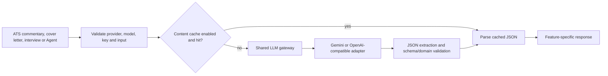
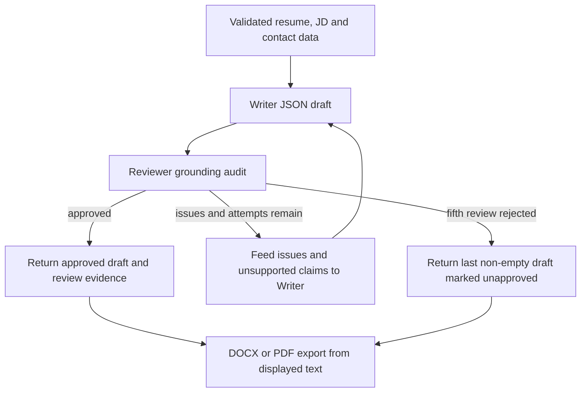
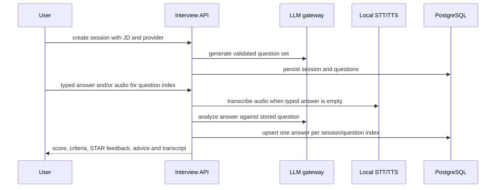

# LLM-Assisted Career Tools

## Shared gateway

`src/wecanfindintern/llm/gateway.py` is the only provider routing boundary. It supports Gemini, OpenAI-compatible providers (OpenAI, DeepSeek, GLM, Qwen, Ollama), bounded timeouts, limited retries, JSON response handling, key sanitation, and usage reporting.

`clean_api_key()` strips whitespace, quotes, and an optional leading Bearer prefix. Ollama is treated as a local provider and uses the internal `local` key marker. `resolve_api_key()` rejects missing keys for remote providers.

`complete_json()` validates model/provider, normalizes a `models/` prefix, calls the selected adapter, and returns `LLMResult(data, usage, provider, model)`. Transport failures can retry with exponential delay. JSON parsing and validation failures are not retried because repeating an invalid response multiplies cost without fixing the model output.

`parse_json()` accepts raw JSON, markdown fenced JSON, JSON surrounded by prose, and the last balanced JSON object/array when a provider emits multiple blocks. It rejects scalar results.

Prompt templates live in `llm/prompts/` and are separated from business services. Supplied resume/JD/company text is treated as reference data, not as executable instructions, in the system prompts.

## Resume ATS Score and ATS Match

ATS scoring does not use the LLM gateway. `ats/parsing_readiness.py` computes
PDF/text parsing diagnostics, while `ats/match_scoring.py` computes a separate
resume-to-job score from source-backed requirements and published weights. The
two diagnostics do not accept provider settings and cannot be influenced by an
LLM.

Resume ATS Score adds an optional qualitative layer through
`POST /api/v1/ats/score/commentary`. It uses the selected provider to explain
the completed deterministic diagnostic with a summary, strengths, and priority
improvements. The model is not allowed to recalculate or replace the score, and
commentary failure does not hide or invalidate the score.

`POST /api/v1/resumes/extract-pdf` is the shared PDF extraction boundary for
Resume ATS Score, ATS Match, Cover Letter, and Interview. It returns text plus
page-aware parsing readiness.

`POST /api/v1/ats/score` returns the standalone text-only parsing score, while
`POST /api/v1/ats/match` consumes resume text and a job description and returns
deterministic match evidence. See
[ATS-Style Resume Diagnostics](ats-review.md) for formulas and limitations.

## Cover-letter generation

`cover_letter/service.py` validates resume, JD, selected model, API key, and required contact details (full name, email, phone, LinkedIn or portfolio). It then loops through at most five Writer/Reviewer attempts:

1. Writer receives resume, JD, company/context fields, prior draft, and prior review feedback.
2. Writer returns structured JSON containing the letter and optional HR information.
3. Reviewer receives the factual reference blocks and draft.
4. If approved, the response returns the draft and review data.
5. If rejected, issues, unsupported claims, and summary become revision feedback for the next attempt.

After five attempts, the last non-empty letter is returned with `review_approved=false` and the final review summary, so the user can inspect it instead of assuming it is grounded. Writer and reviewer token counts are accumulated separately.

`cover_letter/export.py` renders the generated text as DOCX or PDF. The export route does not call the model; it serializes the already displayed draft.

## Mock interview

`interview/service.py` provides structured question generation from a job description, text-to-speech through `gTTS`, and provider-agnostic answer analysis from typed text or a locally transcribed audio answer.

Question generation accepts either a top-level JSON array or an object containing `questions`, then validates each item with `InterviewQuestionItem`. Answer analysis returns score, summary, STAR feedback, timeline, advice, and — when audio was recorded — the local transcript, detected language, and answer duration.

Recorded answers are transcribed on-device by `interview/stt.py` using faster-whisper (model configurable through `INTERVIEW_STT_MODEL`, default `base`, downloaded and cached on first use). The transcript fills the answer text when the user did not type one; a typed answer takes precedence. Transcription failures return actionable errors (missing package, empty upload, no speech detected) instead of provider errors. There is no multimodal provider lock-in: content analysis uses the common JSON gateway for every provider.

Practice runs are persisted in `interview_sessions` / `interview_answers`
(migration `0021`). `POST /sessions` generates and stores a question set;
`POST /sessions/stream` emits validated question progress and then persists the
same session contract. `POST /analyze` upserts one analyzed answer per
`(session_id, question_index)` when both are supplied. `GET /sessions`,
`GET /sessions/{id}`, `DELETE /sessions/{id}`, and `GET /trend` back the UI history
panel, where trend aggregation (average, per-session scores, improvement since
the first session) is computed in `repository.summarize_trend`.

Question playback supports two TTS backends selected through `INTERVIEW_TTS_BACKEND`: `gtts` (default, online Google TTS, MP3) and `local` (macOS `say` or Windows PowerShell/System.Speech, offline WAV). The route returns the backend-specific media type.

## Provider behavior

The front end chooses provider/model/API base and sends them per request. The server validates provider names and required credentials at the route/service boundary. Ollama uses its configured base URL and model while remote providers use their provider-specific adapters.

The system does not assume every provider supports structured response formatting: OpenAI, DeepSeek, GLM, Qwen and Ollama receive the JSON-object response format; Gemini relies on the common parser and prompt contract.

## Retry, fallback, and partial-result rules

The gateway retries only transport-like provider failures, with a bounded
exponential delay and the caller's retry limit. Missing key/model/provider,
malformed JSON, and business validation failures are not retried. A cache lookup
hit returns the parsed result without a provider call; an unavailable cache is
treated as a miss and must not block the feature.

| Feature | Guaranteed fallback |
|---|---|
| salary/recruiting-term enrichment | structured source/regex result; failed LLM leaves existing value intact |
| ATS score/match | deterministic result independent of provider |
| ATS commentary | deterministic score remains visible if commentary fails |
| cover letter | up to five Writer/Reviewer rounds, then last non-empty draft marked unapproved |
| interview answer | typed answer takes precedence; local STT failure is actionable and does not corrupt history |
| Agent plan | safe assistant response; no approval/write from malformed or incomplete output |

These are fallbacks, not silent claims of success: UI/API responses preserve
warnings, failure state, approval state, or `review_approved=false` where
applicable.

## User and provider scenarios

| Situation | Result | Supported action |
|---|---|---|
| Remote key/model is absent | validation error before provider execution | configure Settings and resubmit |
| Ollama is selected | local marker and configured base URL/model are used | start Ollama and ensure the model is available |
| Transport/rate-limit failure | bounded gateway retry, then feature error/fallback | inspect provider connectivity and retry the feature |
| Provider returns malformed JSON | no transport retry and no unsafe mutation | choose a compatible model or retry with corrected configuration |
| ATS commentary fails | deterministic diagnostic remains visible | use the score/evidence or retry commentary |
| Cover-letter reviewer rejects five drafts | last draft is returned with `review_approved=false` | inspect issues before editing/exporting |
| Interview audio has no speech or STT dependency fails | answer analysis is not fabricated | type an answer or repair the local STT setup |
| Typed and audio answers are both supplied | typed answer is authoritative; transcript remains metadata | review the typed answer and analysis |
| TTS backend fails | question/session data remains intact | read the question or switch/fix the configured backend |

## Frontend responsibilities

The cover-letter, interview, Agent, and settings modules use the shared settings
state. Browser mode stores provider configuration in localStorage; desktop mode
stores API keys through Electron `safeStorage` and retains only non-secret
preferences in localStorage. ATS does not require an AI key. Career modules
prevent requests with missing required input, show bounded progress states,
render escaped output, preserve warnings, and reset temporary state when the
user clears a feature.

## Verification surface

`tests/test_ats_commentary.py`, `tests/test_cover_letter.py`, and
`tests/test_interview.py` cover gateway consumers, grounding/revision behavior,
session persistence, STT/TTS contracts, errors, and routes. Agent and enrichment
tests cover the same gateway boundary for their owning modules.
