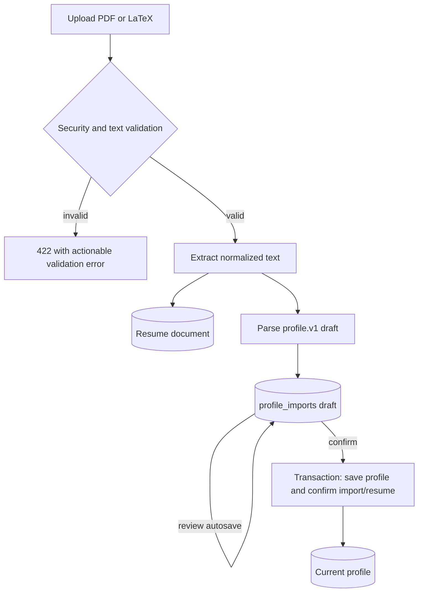

# Profile and Resume Import Module

## Purpose

The Profile module provides a reusable `profile.v1` candidate record and a controlled path from an English resume file to a user-confirmed structured profile. The profile is used by recommendations, ATS review, cover-letter generation, and Agent tools.

## Data model

The profile contains:

- `basics`: name, preferred name, email, phone, city, region, country, and professional links;
- `education`;
- `work_experience`;
- `projects`;
- `skills`;
- `certifications`;
- `languages`;
- `awards`.

Pydantic models in `profile/models.py` enforce field lengths, list shapes,
URL/contact formats where defined, and the `schema_version`. The database stores
one current profile and no version history. Repeated sections are stored in child
tables under `user_profiles`; their public UUIDs remain stable across edits. The
repository calculates completion percentage from populated profile fields.

## Resume input boundary

The secure boundary is `profile/security.py` and is used by the Profile upload
route and the shared `/api/v1/resumes/extract-pdf` route consumed by ATS,
Cover Letter, and Interview.

Only English `.pdf` and `.tex` are accepted. The validator checks safe filename and supported extension, declared MIME type, non-empty content, PDF magic bytes or valid text LaTeX content, size, structure, extracted-text limits, minimum meaningful text, and English-language heuristics.

### PDF behavior

PDFs are limited to 8 MB and the configured page range. The parser rejects encryption/password protection, malformed documents, incomplete trailers, active content, image-only/scanned content, and extracted text that expands beyond the configured cap. It extracts text page by page. HTTP/HTTPS/mailto link annotations not already present in the text are appended under a Links section.

### LaTeX behavior

LaTeX is limited to 1 MB, must be UTF-8 text, must not contain NUL bytes, and must look like a document/resume source. Dangerous file-access and executable commands are rejected. The parser strips comments, document commands, formatting wrappers, environments, and simple escaped characters into readable text. It never compiles or executes the source.

The secure validator and the plain PDF extractor intentionally have different minimum-text thresholds: the upload/import path rejects very short or image-only resumes, while the generic ATS extraction endpoint accepts a valid text PDF with a smaller minimum suitable for review feedback.

## Import lifecycle

Normal profile edits autosave the single current record. The parser creates a
draft rather than mutating that record. Review edits autosave only the draft in
`profile_imports`; existing profile data is retained unless the user explicitly
applies the import. Apply updates the profile and confirms the import/resume in
one transaction.

## Repository behavior

`profile/repository.py` creates/loads the single local profile, serializes repeated child records, stores resume metadata and extracted text, creates import records, returns draft data, confirms an import, and deletes resume/import data. Deleting a resume also removes its dependent import draft through database ownership rules.

The API returns summaries for the resume history rather than exposing unnecessary full document internals. Export returns the current structured profile suitable for the Agent and career tools.

## API

- `GET /api/v1/profile`: current profile.
- `PUT /api/v1/profile`: save the current profile payload.
- `GET /api/v1/profile/export`: profile export payload.
- `GET /api/v1/profile/context`: profile plus the canonical resume-text projection used by AI sections.
- `POST /api/v1/profile/resumes`: upload, validate, extract, and create an import draft (201).
- `GET /api/v1/profile/resumes`: list resume summaries.
- `DELETE /api/v1/profile/resumes/{resume_id}`: delete resume and related draft.
- `PUT /api/v1/profile/imports/{import_id}`: autosave an import review draft without applying it.
- `POST /api/v1/profile/imports/{import_id}/confirm`: apply a draft to the saved profile.

Invalid file type, MIME mismatch, unsafe content, extraction failure, and invalid draft data are returned as user-readable 422 errors. Missing resume/import/profile resources return 404.

## User and data scenarios

| Situation | Current profile | Import/resume result |
|---|---|---|
| Valid PDF/LaTeX upload | unchanged | resume and editable draft are created |
| Draft field edit | unchanged | only `profile_imports.parsed_payload` is updated |
| Confirmed draft | replaced atomically with reviewed payload | import and resume become confirmed |
| Invalid, scanned, encrypted, active-content, oversized, or non-English input | unchanged | 422; no import is created |
| Duplicate file content for the same profile | unchanged until confirmation | resume row is refreshed by SHA-256 identity and a new draft is created |
| Resume deletion | unchanged | resume and dependent imports are deleted by ownership rules |
| Direct Profile autosave | current profile updated transactionally | existing import drafts remain separate |

## Frontend editing behavior

`web/modules/profile.js` renders repeated sections dynamically, preserves stable
entry IDs, autosaves normal edits, autosaves import reviews to the draft route,
and reserves the current-profile mutation for explicit Apply. It also supports
discard, refreshes resume history, and asks for confirmation before deleting a
resume.

## Data handling rules

The profile is personal data. ATS scores are calculated locally by deterministic
server code and do not send resume content to an LLM. Profile data should be
sent to external LLM providers only when the user explicitly uses cover-letter,
interview, or Agent functionality and selects that provider. Provider keys
remain in browser settings and are not persisted in the profile tables.

## Verification surface

`tests/test_profile.py` covers Pydantic models, parser/security boundaries,
draft/confirm semantics, deletion, and routes. Shared extraction behavior is
also exercised by ATS route tests. The source of truth for size and structure
limits is `profile/security.py`.
