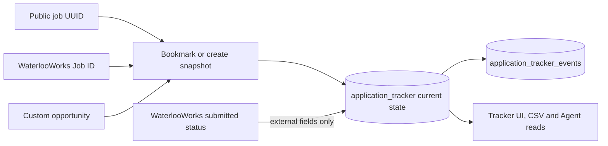
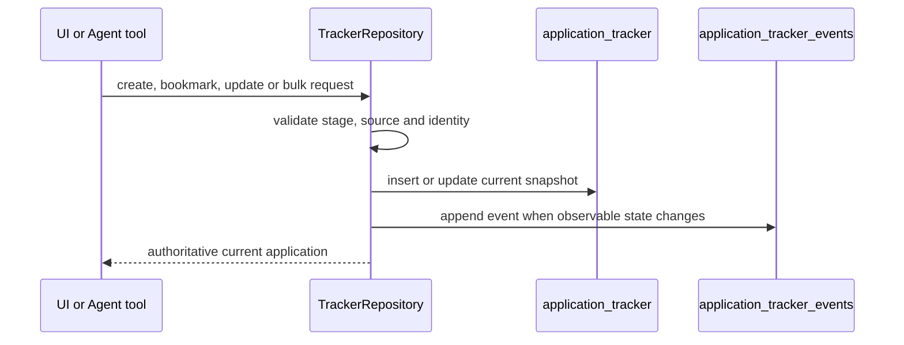
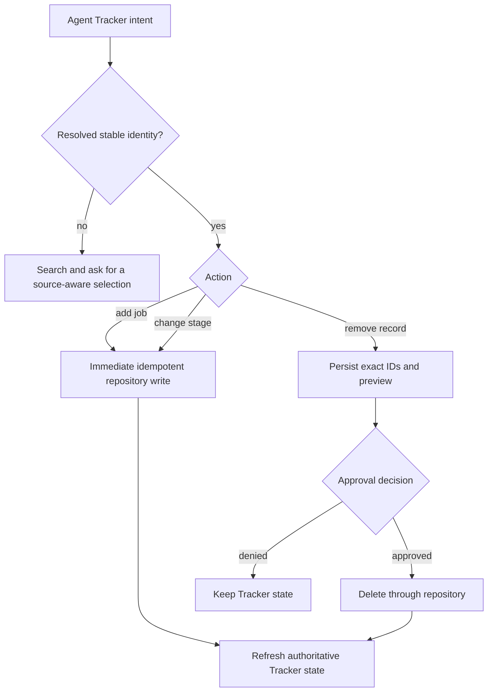

# Application Tracker Module

## Purpose

The Tracker records a candidate’s application workflow independently from changing source postings. It supports public PostgreSQL jobs, WaterlooWorks local jobs, and user-entered custom opportunities.

## Stages and source identity

`tracker/models.py` defines the stages `interested`, `applied`, `interview`, `offer`, and `rejected`. The database does not force a single linear transition; users can edit the current stage. Actual stage transitions are recorded as events so repeated saves do not add duplicate timeline entries.

Tracker origins distinguish platform bookmarks from custom records. Source values retain provider identity for WeCanFindIntern, LinkedIn, Indeed, Glassdoor, ZipRecruiter, Google Jobs, and WaterlooWorks, with `other` as the explicit fallback. A platform record uses a public job UUID. A WaterlooWorks record uses `source_job_id`. A custom record stores its own title/company/link/details without a public-job foreign key.

## Data model

`TrackedApplication` contains the application id, optional job/source identity, title/company/location/description snapshots, source URL, stage, application deadline, salary, and timestamps. WaterlooWorks records additionally expose `external_stage` and the raw `external_status`; these are source observations and are not the user's workflow stage. `TrackedJobState` and `TrackedExternalJobState` represent bookmark state for public and WaterlooWorks jobs.

`application_tracker_events` stores stage and field history tied to the tracker record. Foreign keys cascade events when the parent application is deleted.

## Write semantics

### Bookmarks

`PUT /bookmarks/{job_id}` creates or returns the public platform Interested
record. A unique platform-job index makes repeated clicks idempotent. DELETE
removes an Interested bookmark and returns a protected-stage result after the
record has progressed in the application workflow.

WaterlooWorks has parallel endpoints under `/bookmarks/waterlooworks/{source_job_id}`. The repository retrieves the local WaterlooWorks posting for display fields and keeps it out of the public jobs table.

Submitted-application synchronization updates source-owned job fields and the
external status. It does not overwrite a user's `stage`, clear `archived_at`, or
replace manual stage timestamps on an existing record. A record created by the
first sync uses the external stage only as its initial stage.

### Full applications

`POST /api/v1/tracker` creates a custom/full tracker record. `PATCH /{application_id}` updates editable fields and appends an event for changes. `DELETE /{application_id}` removes the record and event history. Missing IDs return 404.

### Bulk operations

`PATCH /bulk` applies one stage to selected IDs and returns the updated count.
`DELETE /bulk` deletes selected records and returns the deleted count. Empty or
malformed selections are rejected before mutation.

### Idempotency and events

Repeated Interested actions do not create duplicate rows. Stage changes update the current row and create a timestamped event. Repository methods keep mutation and event insertion in the same database operation/transaction boundary so the timeline cannot claim a change that the current snapshot did not receive.

## Read behavior

`GET /api/v1/tracker` supports query, stage, pagination, sort, and direction
controls and returns applications plus statistics/page metadata.
`GET /bookmarks` and `GET /bookmarks/waterlooworks` return bookmark state used
by job cards. `GET /{application_id}/events` returns the chronological timeline.

Response rate is historical rather than current-stage-only: the denominator is every non-Interested or timestamped submission, and the numerator is every record that has ever reached interview or offer. A later rejection or manual stage correction therefore does not erase a previously received response.

Job descriptions and source details are resolved for the tracker drawer. If a source posting has disappeared, the tracker’s saved snapshot remains available and the UI shows that the live description is unavailable rather than deleting the application.

## CSV export

`GET /api/v1/tracker/export.csv` uses `build_tracker_csv()` to serialize the current tracker list. The export contains user-facing application fields, dates, stage, and source links. Internal database IDs and raw provider payloads are not exported.

## Frontend behavior

`web/modules/tracker.js` handles filter persistence in the browser URL, list paging, page-size selection, selection and bulk stage/delete actions, the detail drawer, event timeline loading, custom-job creation, copy/open-link actions, and CSV export. Shared bookmark state and mutations live in `web/modules/bookmarks.js`; it emits invalidation/open requests that `main.js` routes to the lazily loaded Tracker module, avoiding a Tracker↔bookmarks module cycle.

## Agent integration

Agent tools call Tracker repositories rather than duplicating SQL. They resolve
a public UUID, WaterlooWorks Job ID, or Tracker application UUID into a typed
reference. `add_into_tracker` and `update_tracker_stage` execute immediately and
return authoritative Tracker results in the same Agent turn.
`remove_from_tracker` persists the selected application IDs and a deletion
preview, waits for approval, and executes those stored arguments after approval.
Ambiguous title/company references are resolved through search before any
mutation.

## User and concurrency scenarios

| Situation | Tracker behavior | Client action |
|---|---|---|
| Repeated public/WaterlooWorks bookmark | existing Interested/application row is returned | refresh shared bookmark state |
| Unbookmark while stage is `interested` | bookmark record is deleted | remove card state and refresh Tracker |
| Unbookmark after progress beyond `interested` | protected response includes current stage | keep the application and open Tracker |
| Stage or editable field changes | current snapshot and required event update together | render returned row and reload events |
| Submitted status changes in WaterlooWorks | external status/stage and source snapshot update | retain the user-selected stage |
| Source posting disappears | saved application snapshot remains | show saved details and an unavailable-live-source notice |
| Bulk request contains an invalid/empty selection | validation rejects before mutation | correct selection and resubmit |
| Application UUID is absent | 404 with no mutation | refresh the list before retrying |

## Verification surface

`tests/test_tracker.py` covers stages, source identity, idempotent bookmarks,
protected removal, events, external-status separation, bulk operations, stats,
CSV, and route behavior. Frontend route references are verified by the shared
contract script.
