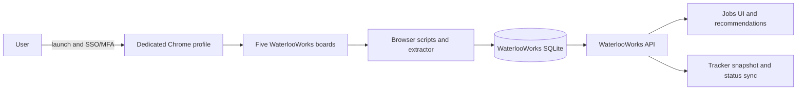
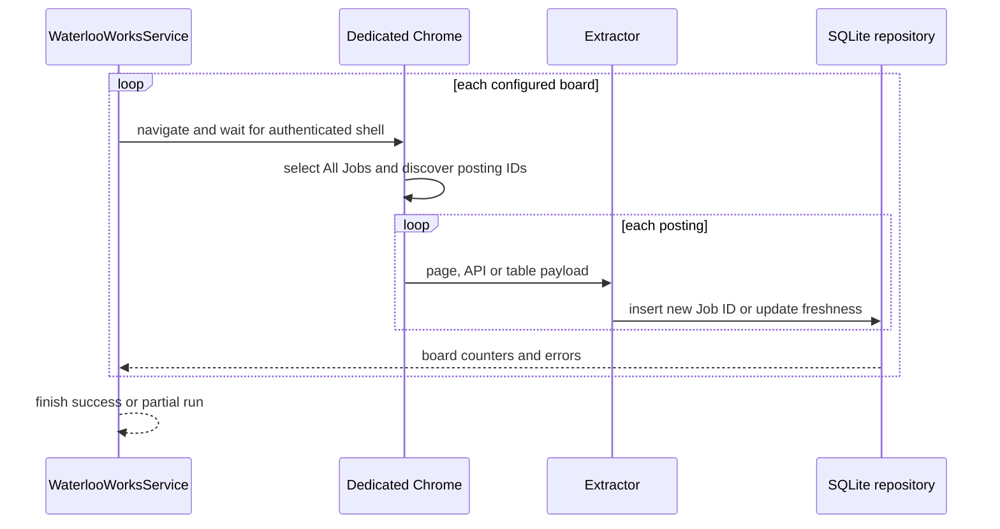

# WaterlooWorks Module

## Purpose and isolation

WaterlooWorks is a browser-assisted, local-only source. It is not inserted into the public PostgreSQL `jobs` table and is not passed through JobSpy’s cross-source deduplication. WaterlooWorks identity is the external Job ID. A Job ID and its first-observed posting data are inserted once and remain immutable on later encounters. Board membership is a separate relationship: a later encounter can add a previously unseen board edge. Re-observation updates only `last_seen_at` freshness metadata on the job and existing board edge; it never rewrites posting content.

The module consists of:

| File | Responsibility |
|---|---|
| `waterlooworks/browser.py` | Chrome discovery, launch, debug-port reuse, target selection, navigation, and JavaScript evaluation |
| `waterlooworks/browser_scripts.py` | Shared extraction JavaScript used by job and application pages |
| `waterlooworks/config.py` | Provider origin, board catalog, and local filesystem configuration |
| `waterlooworks/extractor.py` | DOM/API posting extraction and provider-to-domain normalization |
| `waterlooworks/collector.py` | Board-by-board asynchronous collection and progress updates |
| `waterlooworks/repository.py` | SQLite schema, insert-once jobs, application state, board links, run history, and queries |
| `waterlooworks/records.py` | Shared SQLite row decoding and removal of internal fields |
| `waterlooworks/dates.py` | Toronto-local date parsing for typed consumers; no display conversion |
| `waterlooworks/models.py` | Typed list/detail API contracts |
| `waterlooworks/state.py` | Snapshot and per-board state model |
| `waterlooworks/service.py` | Lifecycle orchestration and concurrency guard |
| `waterlooworks/taxonomy.py` | Canonical board labels plus separate employment/opportunity mappings |
| `application/waterlooworks_tracker.py` | WaterlooWorks-to-Tracker orchestration adapter |
| `api/routes/waterlooworks.py` | HTTP boundary |

## Browser security boundary

The service starts a dedicated Chrome profile, normally at `~/.wecanfindintern/chrome-waterlooworks`, and connects through a local debugging endpoint. It can reuse an already-running matching debug session. The browser window is the only place where the user completes Waterloo SSO and MFA.

The service checks authentication by observing the WaterlooWorks account path and page readiness. It does not receive or store passwords, MFA codes, browser cookies, or session secrets in SQLite or PostgreSQL.

If Chrome is not in the detected system locations, `WATERLOOWORKS_CHROME_BINARY` supplies the executable. `WATERLOOWORKS_CHROME_PROFILE`, `WATERLOOWORKS_URL`, and `WATERLOOWORKS_DB_PATH` override the defaults.

## Board workflow

The configured boards are:

1. Co-op: Full-Cycle (`full_cycle`)
2. Employer-Student Direct (`employer_student_direct`)
3. Graduating jobs (`graduating`)
4. Contract jobs (`contract`)
5. Campus jobs (`campus`)

`WaterlooWorksCollector.collect_all()` processes them independently:

1. Open the board URL in the authenticated target.
2. Select/click `All Jobs` when required.
3. Wait for the result table or posting API to become available.
4. Extract the source Job IDs.
5. Read each posting detail.
6. Normalize and insert the posting only when its source Job ID is not already stored.
7. Insert the `(Job ID, board)` relationship if that edge has not been observed before.
8. Record discovered, newly inserted, already-known, and failed counts for the board.
9. Continue to the next board even when this board fails.

The collector updates the shared `WaterlooWorksSnapshot`, so the UI can display progress without waiting for the whole run.

## Extraction contract

The normalized local record includes source Job ID, title, organization, division, location text, city/province/country, work mode, structured salary, posted date, application deadline, application URL, application delivery, required documents, source URL, description, and the raw posting payload.

Salary extraction converts WaterlooWorks fields into minimum, maximum, interval, and currency. Stored descriptions are cleaned of stray HTML before display. The posting deadline is already Toronto-local source text and list/detail responses display that text directly. Consumers that require a `DATE`, such as Tracker and recommendation expiry, separately parse only its Toronto calendar date without converting through UTC. The raw payload remains local-only and is removed from list/detail API responses.

## SQLite persistence

`WaterlooWorksRepository` opens the configured SQLite file with foreign keys and a 30-second busy timeout. Its schema stores jobs, board memberships, collection runs, and per-board run rows. Writes are keyed by `source_job_id`.

On startup, the service reads the most recent run and reconstructs the UI snapshot. Job content is immutable by source Job ID: a normal re-encounter is counted separately as already known and does not rewrite the posting payload, description, deadline, salary, or derived classification. It updates only `last_seen_at`. A missing board edge may be inserted, while an existing edge updates only its own `last_seen_at`. Schema compatibility upgrades may add missing columns, but they do not backfill or delete existing job content. Submitted-application status remains independently refreshable in `waterlooworks_applications` and Tracker.

List queries support board, text query, company, skill, category, location, work mode, canonical opportunity type, posted date, limit, cursor, and `include_description`. `full_cycle` and `employer_student_direct` map to `opportunity_type=co_op`; they are not silently relabeled as internships. The Campus board contributes `part_time` employment/schedule evidence but does not force an opportunity type, because schedule and opportunity are separate dimensions. Pagination is cursor-based and responses expose `total_count`, `next_cursor`, and `has_more`. List and detail responses use the same row decoder and remove all storage-internal fields.

## Service states

The shared snapshot includes `idle`, `waiting_for_login`, `ready`, `collecting`, `importing`, `completed`, `partial`, and `failed`-style states as produced by the service/collector, together with browser state, page URL, run timestamps, run id, totals, and per-board counters.

- `launch`: opens/reuses Chrome and sets waiting-for-login.
- `get_status`: reconnects to the debug port, checks target/auth/page readiness, and reports whether the browser closed.
- `start_collection`: refuses to start without an authenticated WaterlooWorks target; refuses to start a second active collection; launches a task and returns immediately.
- `close`: cancels an active collector and closes the browser session.

If a board cannot be reached, the board is marked failed and the run can finish as partial. If the browser closes, the service reports idle/closed-browser state rather than claiming a successful sync.

## Retry and restart behavior

The browser collector has bounded readiness waits (page shell, `All Jobs`, and
posting API/table) and isolates failures at board and posting level. It does not
persist a browser page cursor or a per-posting checkpoint. A cancelled or
interrupted run is recovered by launching/reconnecting and running collection
again.

Recovery is safe because the SQLite repository keys posting content by external
Job ID and board membership by `(source_job_id, board)`. A known posting is
counted as known and only `last_seen_at` changes; it is not rewritten from a
possibly partial page. This also means a second run may revisit every board, but
cannot create duplicate posting content. A board failure produces a partial run,
not a rollback of successfully imported boards.

The service lock prevents two collection/application-sync tasks from using the
same Chrome target concurrently. The SQLite busy timeout handles short write
contention; it is not a general retry loop for a permanently locked database.

## User and recovery scenarios

| Situation | Service result | User/operator action |
|---|---|---|
| Waterloo SSO/MFA is incomplete | `waiting_for_login` | finish sign-in in the dedicated window, then refresh status |
| Authenticated browser is ready | collection request is accepted with 202 | follow per-board progress until success/partial |
| One board cannot load | other boards continue and the run becomes `partial` | retain imported jobs, correct the browser/source issue, rerun all boards |
| One posting cannot be parsed | posting failure/count is recorded | rerun collection; known Job IDs remain idempotent |
| Chrome closes during a run | task stops with closed/idle state | launch the dedicated profile and rerun |
| Collection or application sync is active | service lock prevents a second task | wait for the active task and read its status |
| Submitted-application detail fails | list status remains and detail failure is recorded | rerun application sync; Tracker records are retained |
| SQLite is briefly busy | connection waits up to the 30-second busy timeout | let the active write finish, then retry |

## API

- `GET /api/v1/waterlooworks/status`
- `POST /api/v1/waterlooworks/launch`
- `POST /api/v1/waterlooworks/collect` (202)
- `POST /api/v1/waterlooworks/applications/sync` (202): opens Full-Cycle
  Applications, selects `Total Submitted`, reads every page, calls the page's
  `getPostingData` and `getPostingOverview` APIs for complete descriptions,
  inserts missing jobs locally, and idempotently mirrors all application
  statuses into Tracker.
- `GET /api/v1/waterlooworks/jobs` with board, query, company, skill,
  category, city, region, country, work mode, opportunity type, posted-after,
  limit, and cursor filters
- `GET /api/v1/waterlooworks/jobs/{source_job_id}`

Invalid board values are rejected. Not-connected/not-authenticated collection requests return an error instead of opening an uncontrolled browser workflow.

Application status mapping is deterministic: `Not Selected` becomes
`rejected`, `Selected for Interview` becomes `interview`, `Employed` becomes
`offer`, and `Applied` or any unrecognized future status becomes `applied`.
The source status is stored separately as Tracker `external_stage` and
`external_status`. For a new record it also supplies the initial Tracker stage.
Later syncs never overwrite a user's Tracker stage and never clear an archived
record; only the Tracker copy of source-owned fields, external status, and a
missing `applied_at` are refreshed. Missing Job IDs receive one initial job row
before Tracker synchronization; existing job rows remain untouched. If one
detail API call fails, the verified application-list fields are retained and the
run reports a description failure. The `applications` list filter is derived
from `waterlooworks_applications`; application synchronization does not add or
update board membership.

## Verification surface

`tests/test_waterlooworks.py` covers extraction, storage, run state,
application sync, idempotency, and API-facing behavior. `tests/test_routes.py`
covers route contracts; frontend references are checked by
`scripts/dev/verify_frontend_api_contract.py`.
