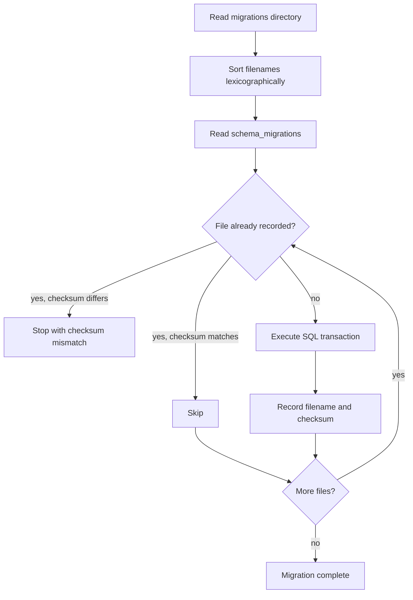

# Database Migrations

The target database is PostgreSQL 16 or newer with the `vector`, `pgcrypto`, and
`pg_trgm` extensions. The provided Docker Compose service uses the pgvector
PostgreSQL 16 image. Apply numbered migrations through the project runner:

```bash
PYTHONPATH=src .venv/bin/python scripts/maintenance/migrate.py
```

For a manual first migration, `psql` can be used with `ON_ERROR_STOP`:

```bash
psql "$DATABASE_URL" -v ON_ERROR_STOP=1 -f migrations/0001_job_data.sql
```

The first migration enables `pgcrypto` and `pg_trgm`; migration 0017 enables
`vector`, and migration 0019 separates vectors into provider/model/dimension
profiles. A database account without extension-creation permission must have an
administrator enable them before the migration runs.

The runner records migration filename and checksum in `schema_migrations` and
refuses to silently accept changes to an already-applied migration. For an
existing database created before this tracking table, verify its schema and run
`migrate.py --baseline-existing` exactly once before applying newer migrations.



## Materialized schema

After the complete migration set is applied, PostgreSQL contains:

- canonical public jobs, source edges, partitioned raw snapshots, ingestion
  runs, dedupe evidence, lifecycle history, classification/location fields,
  recruiting terms, and salary-enrichment state;
- `job_sources.details_fetched_at` for reusable LinkedIn detail payloads;
- Profile/resume/import tables, Tracker snapshots/events, Agent
  sessions/messages/tools/approvals/audit/memory/preferences, interview
  sessions/answers, shared LLM cache, and recommendation
  documents/chunks/embedding profiles/queue state;
- generated full-text search and active partial indexes for public querying,
  plus HNSW indexes for supported recommendation embedding profiles.

Operational collection plans are read from `config/collection_plans.json`.

## Ordering

Migration filenames are applied lexicographically. The complete delivered chain
ends at `0030_collection_performance.sql` and produces the materialized schema
above.

Do not apply a later file to a database that has skipped an earlier file. The runner records applied versions and safely skips already-applied files.

## Raw snapshot partitions

`raw_job_snapshots` is partitioned by month. The ingestion repository calls `ensure_raw_job_snapshot_partition()` before inserting a snapshot. The default partition protects against data loss when a month partition is absent, but should not accumulate records long-term; create upcoming monthly partitions and monitor it.

## Operational rules

- Back up before schema changes in shared environments.
- Run migrations with `ON_ERROR_STOP` semantics.
- Verify indexes and constraints after applying a migration.
- Use the maintenance/backfill scripts when a derived field or classification version changes.
- Keep raw snapshot retention and deletion aligned with source terms and privacy requirements.
